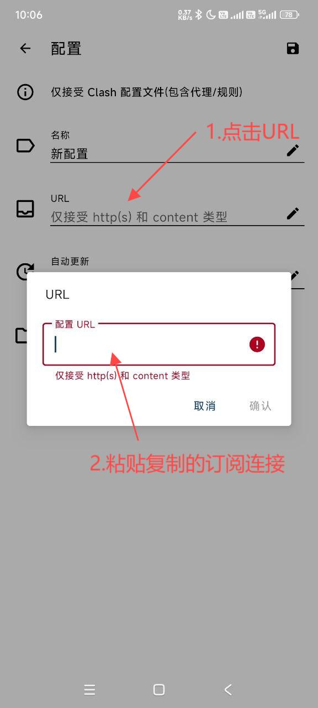
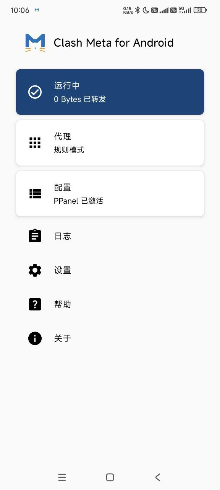

# Clash Meta for Android

## Product Introduction

[Clash Meta for Android](https://github.com/MetaCubeX/ClashMetaForAndroid) is an Android proxy tool developed based on the Clash Meta project, featuring powerful functionality and stable performance.

### Supported Protocols

- Shadowsocks (SS)
- ShadowsocksR (SSR)
- Socks
- Snell
- V2Ray
- Trojan

## System Requirements

- System Version: Android 7.0+
- Applicable Devices: Android phones/tablets

## Download

[Download Address 1](https://git.886.be/https://github.com/MetaCubeX/ClashMetaForAndroid/releases/download/Prerelease-alpha/cmfa-2.11.6-alpha-universal-release.apk)

[Download Address 2](https://gh.xxooo.cf/https://github.com/MetaCubeX/ClashMetaForAndroid/releases/download/Prerelease-alpha/cmfa-2.11.6-alpha-universal-release.apk)

[Download Address 3](https://github.com/MetaCubeX/ClashMetaForAndroid/releases/download/Prerelease-alpha/cmfa-2.11.6-alpha-universal-release.apk)

[Download Address 4](https://tagcloud.lanzouw.com/i02u02b85x8d)

## User Guide

### Configuration Steps

1. Download and install the app
2. Launch Clash Meta
3. Import configuration
4. Select proxy nodes
5. Enable connection service

### Operation Guide

---
*Update Time: 2024.11.16*
