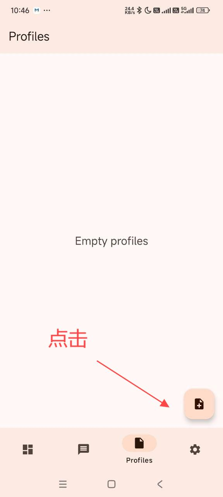

# Sing-box

## Introduction

[Sing-box](https://github.com/SagerNet/sing-box/releases/download/v1.10.1/SFA-1.10.1-universal.apk) is a next-generation universal cross-platform proxy client software, supporting multiple platforms including iOS and Apple TV, completely free.

### Key Features

- Cross-platform support
- Open source and free
- Continuous updates and maintenance
- Excellent performance

### Supported Protocols

- Shadowsocks
- VMess
- Trojan
- Hysteria 2

## System Requirements

- Operating System: Android 5.0 and above
- Applicable Devices: Android phones/tablets

## User Guide

### Configuration Steps

1. Download and install the app
2. Open Sing-box
3. Import configuration file
4. Select server
5. Start connection

### Detailed Guide

---
*Last Updated: 2024.11.16*
