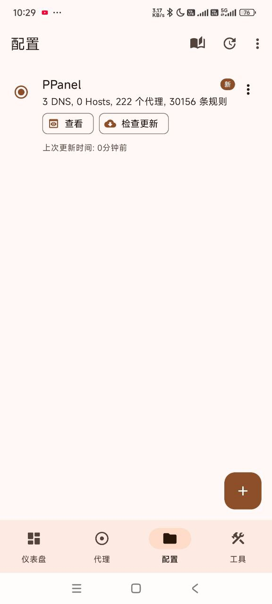
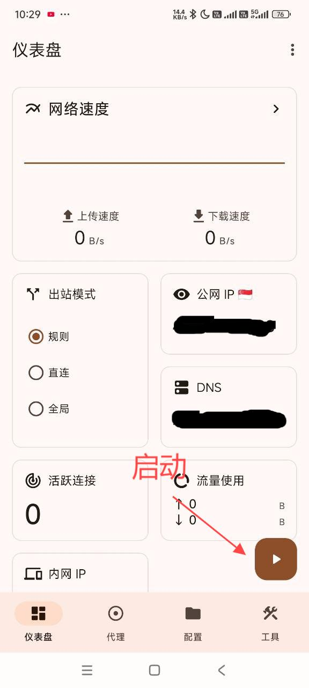

# Surfboard

## Introduction

[Surfboard](https://tagcloud.lanzoui.com/ifnU10daxxte) is an Android proxy tool with excellent performance and beautiful interface, fully compatible with Surge configurations.

### Supported Protocols

- Shadowsocks (SS)
- V2Ray (VMess)
- Trojan
- HTTP/HTTPS
- SOCKS5
- SOCKS5 over TLS

## System Requirements

- Operating System: Android 9.0 and above
- Applicable Devices: Android phones/tablets

## Configuration Guide

### Import Steps

1. Open Surfboard app
2. Click the menu in the top right corner
3. Select configuration source
4. Import configuration file
5. Select node and connect

### Visual Guide

---
*Document Updated: 2024.11.16*
