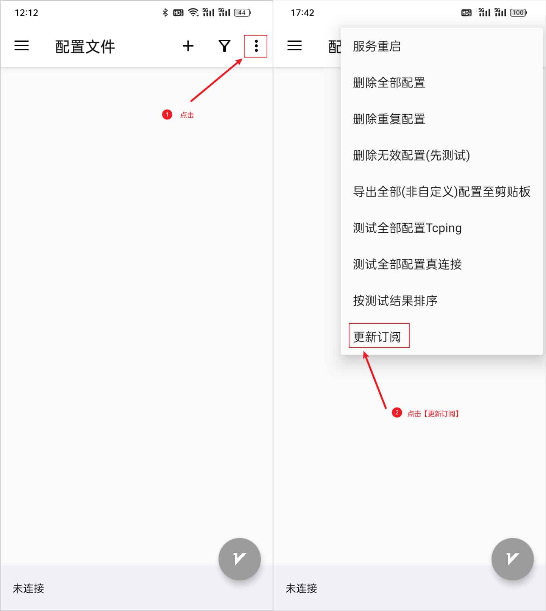

# v2rayNG

[v2rayNG](https://github.com/2dust/v2rayNG) is a powerful proxy client software for Android operating system that supports multiple proxy protocols.

## Supported Protocols

- VMess
- VLESS
- Shadowsocks
- Socks
- Trojan
- Wireguard

## System Requirements

- Operating System: Android 5.0 and above
- Compatible Devices: Android phones/tablets

## Download Links

[Download Link 1](https://git.886.be/https://github.com/2dust/v2rayNG/releases/download/1.9.33/v2rayNG_1.9.33_universal.apk)

[Download Link 2](https://gh.xxooo.cf/https://github.com/2dust/v2rayNG/releases/download/1.9.33/v2rayNG_1.9.33_universal.apk)

[Download Link 3](https://github.com/2dust/v2rayNG/releases/download/1.9.33/v2rayNG_1.9.33_universal.apk)

[Download Link 4](https://dl.v2rayng.org/releases/latest/v2rayNG_1.8.12.apk)

## Installation Guide

The installation process is straightforward. If you download it from an app store, simply follow the prompts to download and install. If you download it from the official website or other third-party sources, you'll get a file named v2rayNG_x.x.x.apk, where .apk is the Android system installation package and x.x.x represents the version number. Just click to install - it's very simple.

After installation, open the app to enter the main interface, which is the configuration file interface, as shown in the image below.

## Usage Guide

### 1. Import Subscription Link

Copy the subscription link

Click the import button in the top right corner, select subscription link, then click confirm to import the subscription link.

### 2. Update Subscription Nodes

### 3. Connect to a Node

