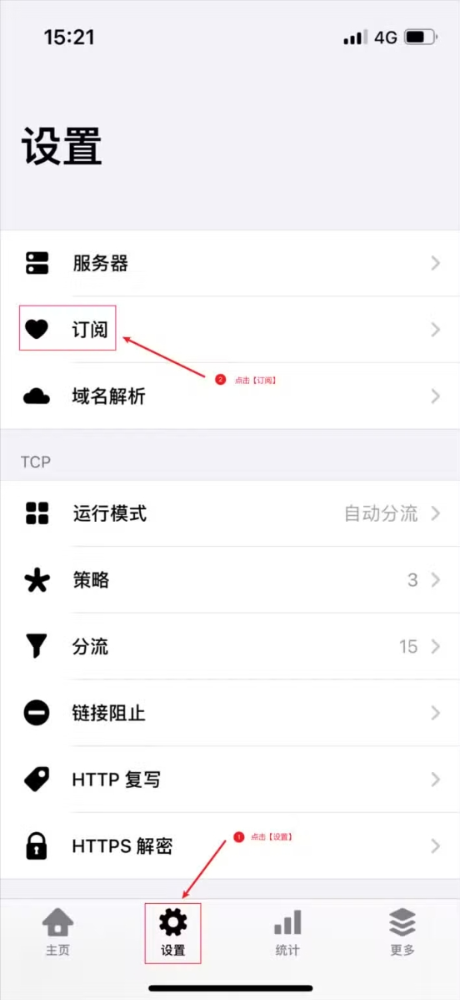
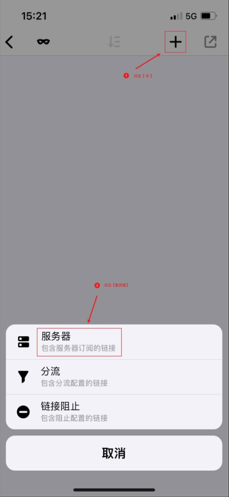

# Quantumult - Classic Network Tool

Quantumult is the classic version of Quantumult X, providing stable and reliable basic functionality.

## Features

- Support for major protocols: SS, SSR, VMess, Trojan
- Basic routing functionality
- Simple policy group configuration
- Stable performance
- Low memory footprint

## Basic Information

- **System Requirements**: iOS 9.0 or later
- **Compatible Devices**: iPhone / iPad

> ⚠️ **Important Notes**
>
> - This app is not available in the mainland China App Store
> - Requires non-mainland China Apple ID for download

## Usage Guide

### Import Configuration

---

Last updated: 2024.11.17
