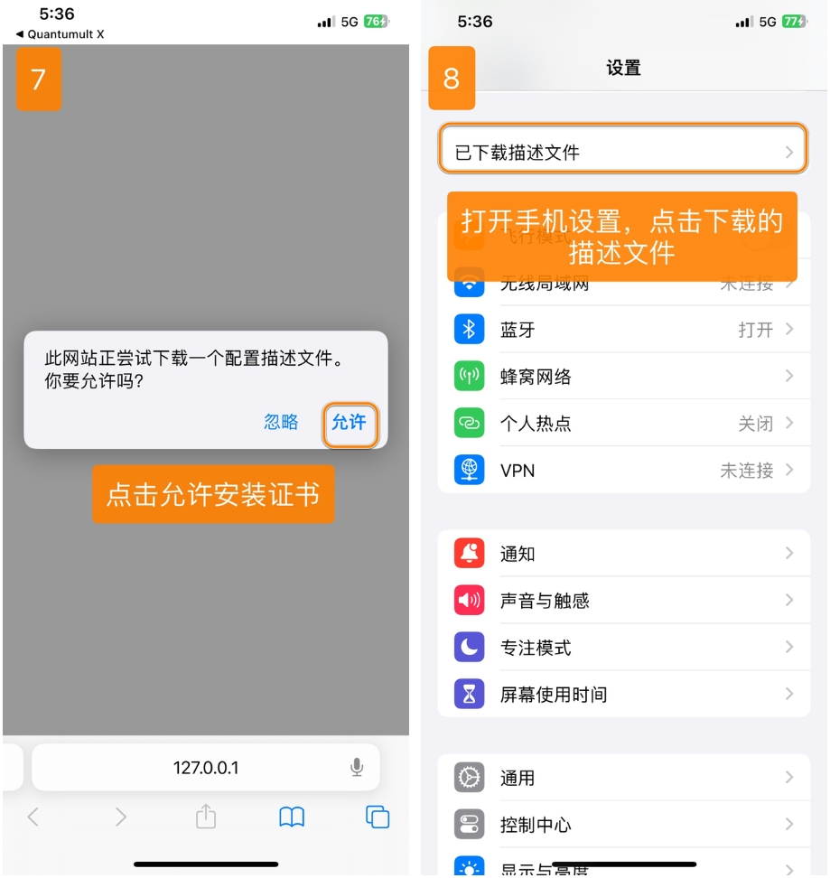
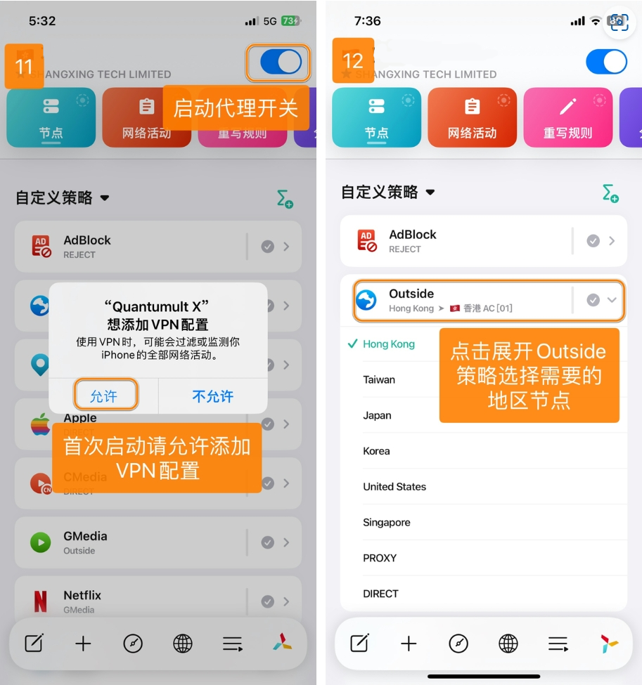
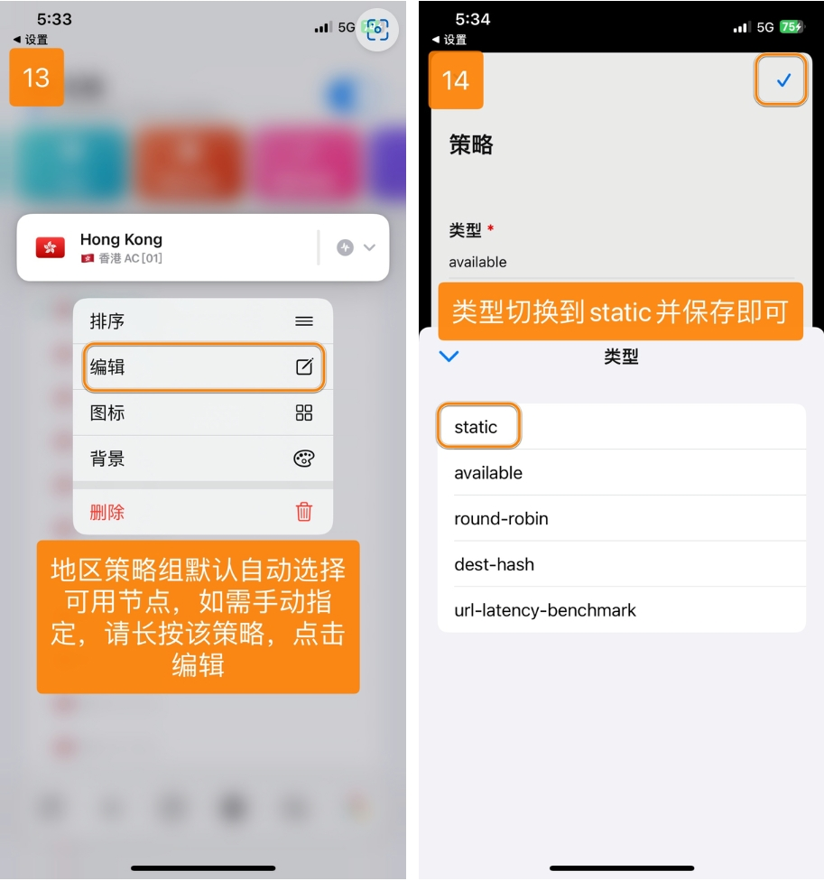

# Quantumult X - Advanced Network Tool Platform

Quantumult X is a feature-rich network tool platform offering powerful customization capabilities and extensive functionality.

## Features

- Multi-protocol support: SS, SSR, VMess, Trojan
- Highly customizable routing system
- Powerful rewrite capabilities
- JavaScript scripting support
- Dynamic policy group switching
- Gallery feature support

## Basic Information

- **System Requirements**: iOS 13.0 or later
- **Compatible Devices**: iPhone / iPad

> ⚠️ **Notes**
>
> - This app is not available in the mainland China App Store
> - Requires non-mainland China Apple ID for download

> ⚠️ **Important Notice**

- Please note that Quantumult X for iOS is a paid software, you need to purchase it yourself
- For this software, we do not provide rule configurations, scripts, or advanced usage methods. Due to the limited experience and knowledge of our customer service, we can only provide you with basic tutorials for importing subscriptions and opening proxies. Advanced usage methods require you to search for relevant materials and learn independently. We cannot provide assistance at this time, please understand.

## Usage Guide

### Import Configuration

---

### Custom Policies

---

### Update Configuration

---

Last updated: 2024.11.17
