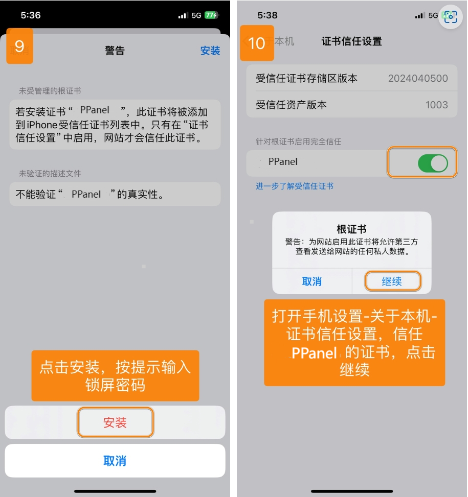

# Quantumult X - Advanced Network Tool Platform

Quantumult X is a feature-rich network tool platform offering powerful customization capabilities and extensive functionality.

## Features

- Multi-protocol support: SS, SSR, VMess, Trojan
- Highly customizable routing system
- Powerful rewrite capabilities
- JavaScript scripting support
- Dynamic policy group switching
- Gallery feature support

## Basic Information

- **System Requirements**: iOS 13.0 or later
- **Compatible Devices**: iPhone / iPad

> ⚠️ **Important Notes**
>
> - This app is not available in the mainland China App Store
> - Requires non-mainland China Apple ID for download

## Usage Guide

### Import Configuration

---

### Custom Policies

---

### Update Configuration

---

Last updated: 2024.11.17
