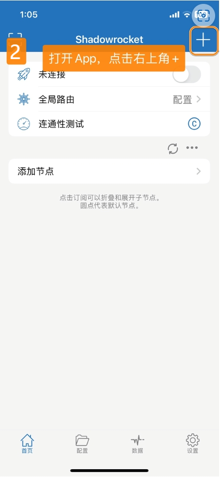
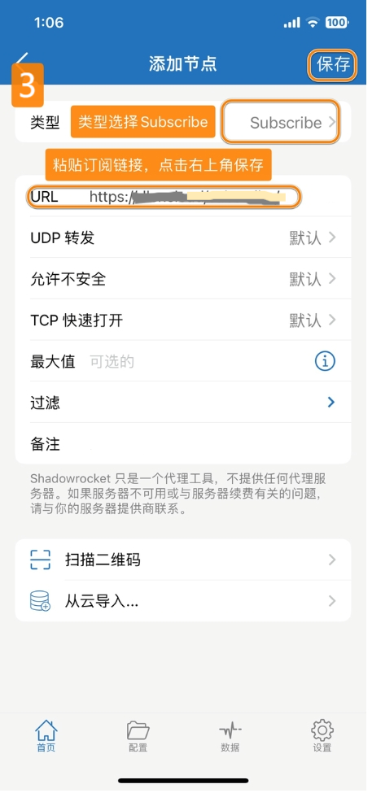
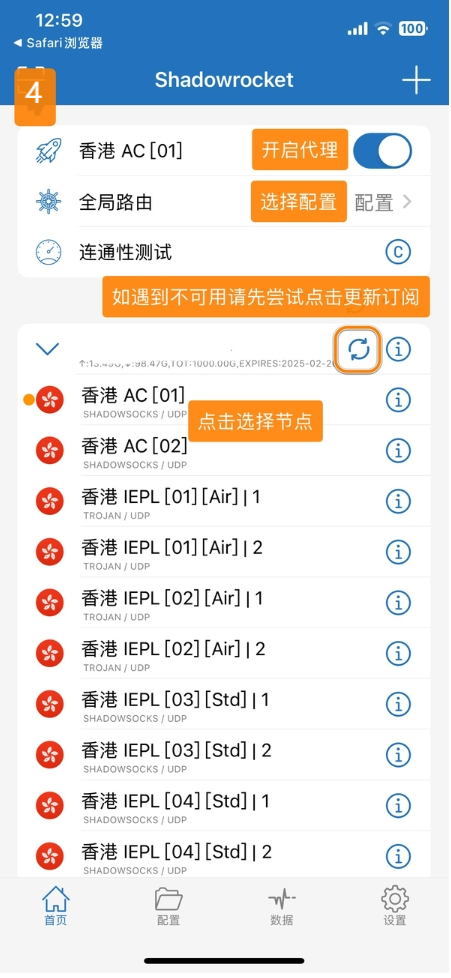

# Shadowrocket - Lightweight Network Tool

Shadowrocket is a lightweight yet powerful network tool known for its simple interface and stable performance.

## Features

- Multi-protocol support: SS, SSR, V2Ray, Xray, Trojan
- Clean and intuitive user interface
- Rule-based routing system
- Script functionality support
- Low resource consumption

## Basic Information

- **System Requirements**: iOS 9.0 or later
- **Compatible Devices**: iPhone / iPad

> ⚠️ **Important Notes**
>
> - This app is not available in the mainland China App Store
> - Requires non-mainland China Apple ID for download

## Usage Guide

### Import Configuration

---

Last updated: 2024.11.17
