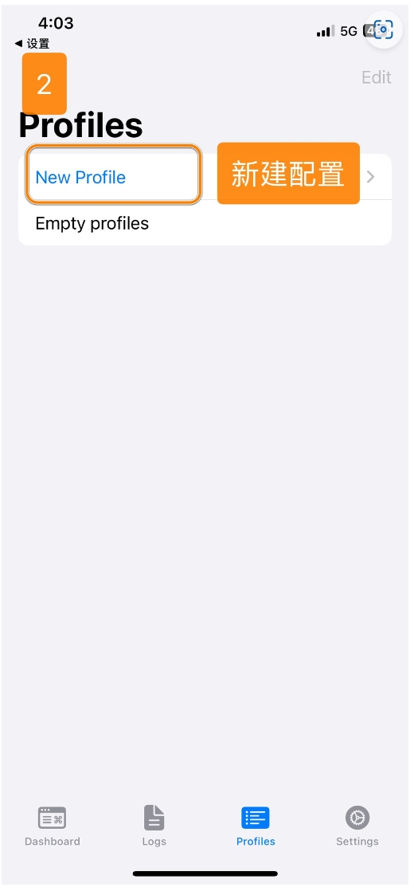

# Sing-box - Next Generation Universal Proxy Tool

Sing-box is a universal proxy tool developed in Go, featuring high performance and cross-platform compatibility.

## Features

- Full protocol support: Shadowsocks, VMess, Trojan, etc.
- Built-in DNS server
- TUN mode support
- Flexible routing system
- Real-time traffic monitoring

## Basic Information

- **System Requirements**: iOS 15.0 or later
- **Compatible Devices**: iPhone / iPad

> ⚠️ **Notes**
>
> - This app is not available in the mainland China App Store
> - Requires non-mainland China Apple ID for download

> ⚠️ **Important Notice**

- Please note that Sing-box for iOS is a paid software, you need to purchase it yourself
- Please be aware that this is professional software. We only provide basic usage tutorials and cannot provide troubleshooting or advanced usage support. Your understanding is appreciated.

## Usage Guide

### Import Configuration

---

### Update Configuration

---

Last updated: 2024.11.17
