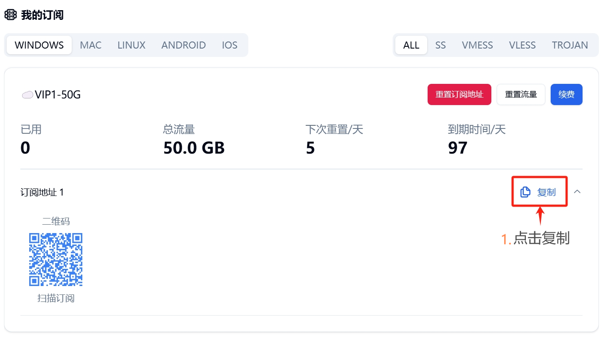
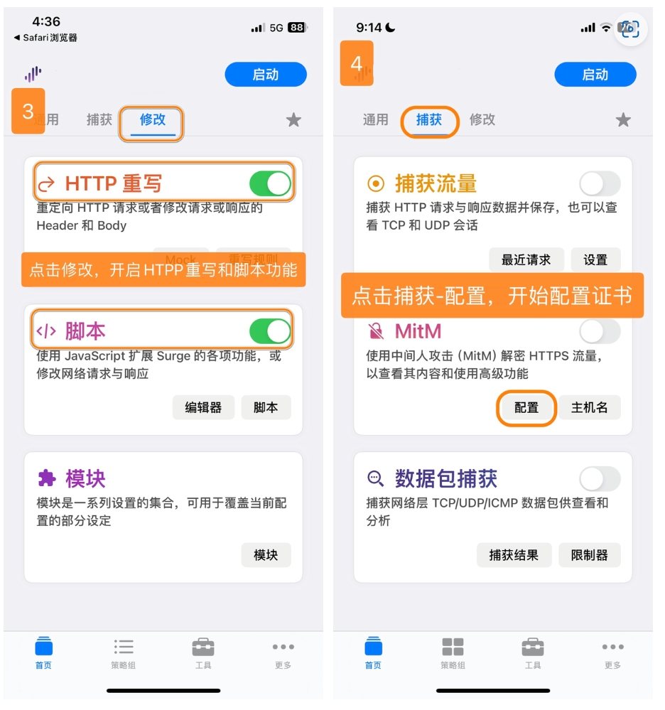
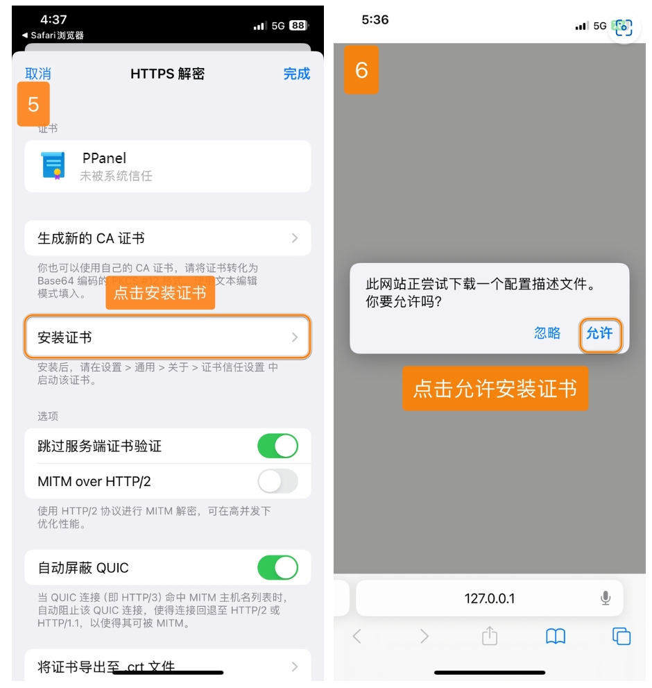
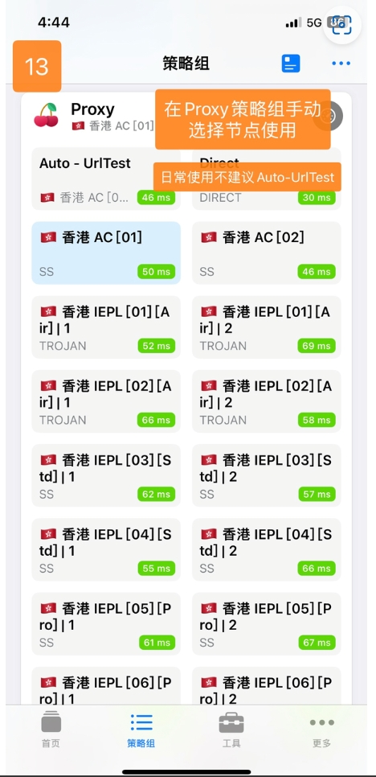

# Surge - Professional iOS Network Toolkit

Surge is a powerful network toolbox platform that serves not only as a proxy tool but also as a full-featured network debugging utility.

## Features

- Support for multiple proxy protocols: SS, VMess, Trojan, Snell, etc.
- Powerful rules system
- Real-time network monitoring
- MitM and scripting capabilities
- High-performance and energy-efficient architecture

## Basic Information

- **System Requirements**: iOS 9.0 or later
- **Compatible Devices**: iPhone / iPad
- **Software Version**: Surge 2/3/4/5

> ⚠️ **Notes**
>
> - This app is not available in the mainland China App Store
> - Requires non-mainland China Apple ID for download
> - Does not support SSR protocol

> ⚠️ **Important Notice**

- Please note that Surge for iOS is a paid software that requires purchase, but it offers a 7-day trial
- Please be aware that this is professional software. We only provide basic usage tutorials and cannot provide troubleshooting or advanced usage support. Your understanding is appreciated.

## Usage Guide

### Import Configuration

---

### Update Configuration

---

Last updated: 2024.11.17
