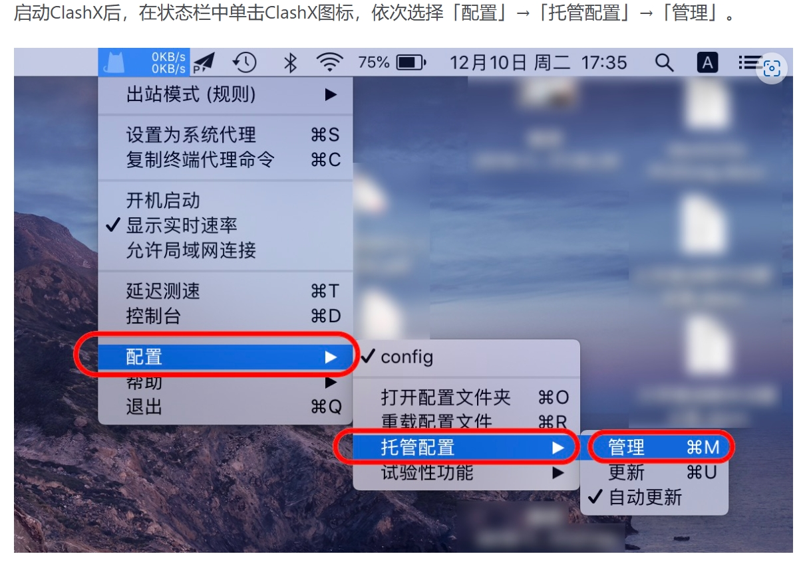
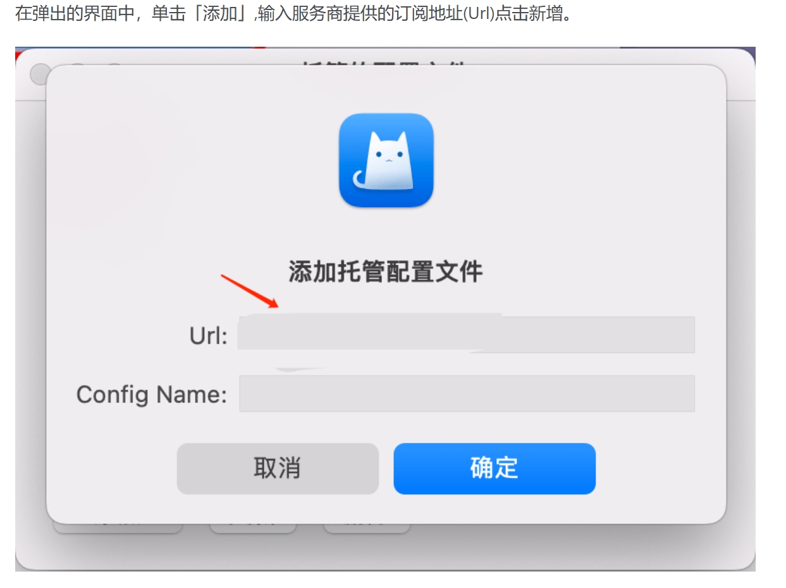

# ClashX Pro

[ClashX Pro](https://clashxhub.com/apps/ClashXPro.dmg) is a modern macOS proxy tool that supports:

- Shadowsocks (SS)
- V2Ray (VMess)
- Trojan
- HTTP/HTTPS
- SOCKS5
- SOCKS5 over TLS

## Requirements

> ⚠️ System Requirements

- Operating System: macOS 10.5 or higher
- Software Version: ClashX Pro for macOS
- Compatible Devices: MacBook / iMac / Mac Pro

## Configuration Guide

### 1. Software Installation

---

### 2. Import Configuration

---

*Document Updated: 2024.11.17*
