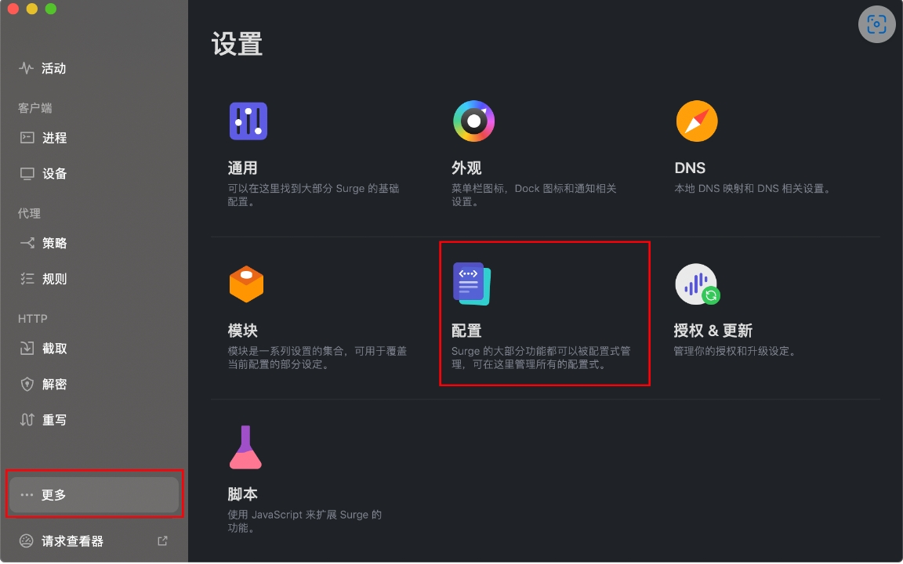
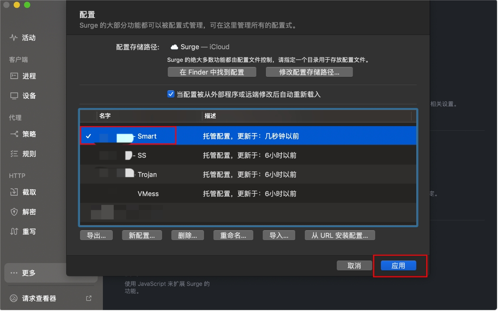

# Surge for macOS

[Surge for macOS](https://nssurge.com/buy_now) is a powerful macOS network utility that supports multiple proxy protocols:

- Shadowsocks (SS)
- V2Ray (VMess)
- Trojan
- HTTP/HTTPS
- SOCKS5
- Snell
- SOCKS5 over TLS

## Requirements

> ⚠️ System Requirements

- Operating System: macOS 10.5 or higher
- Software Version: Surge 3+ for macOS
- Compatible Devices: MacBook / iMac / Mac Pro

> ⚠️ Important Notes

- Surge for macOS is a paid software, you need to purchase it yourself
- This software is a professional software, we only provide basic usage tutorials, and cannot provide troubleshooting, advanced usage support, etc.

## Configuration Guide

### Import Configuration Steps

---
*Document Updated: 2024.11.17*
