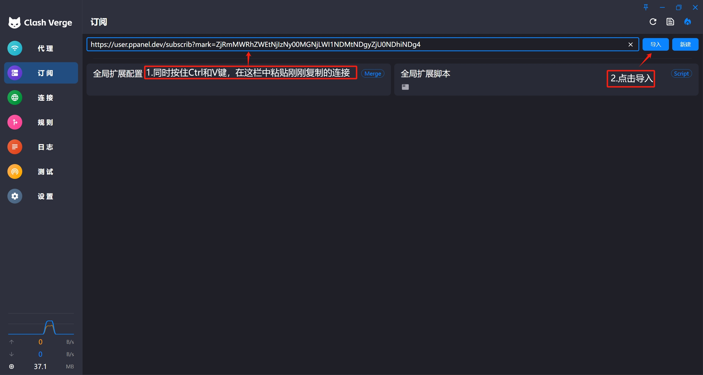
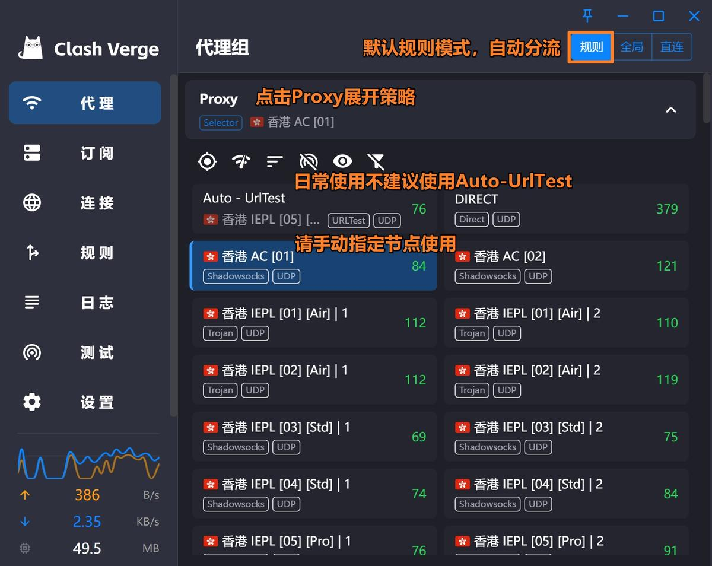
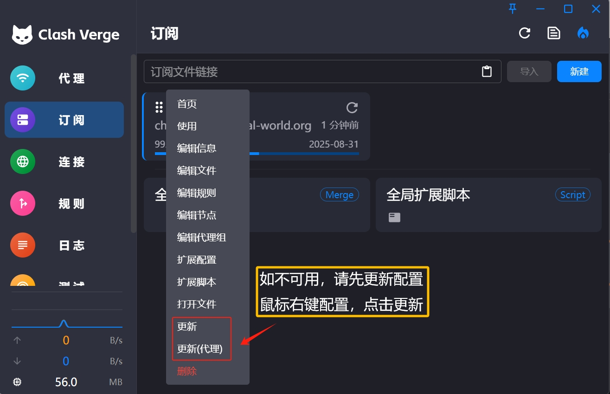

# Clash Verge

[Clash Verge](https://github.com/clash-verge-rev/clash-verge-rev/releases/download/v1.7.7/Clash.Verge_1.7.7_x64-setup.exe) is a GUI client for the Clash proxy tool, supporting Windows, Linux, and macOS systems. It features powerful routing rules and supports multiple proxy protocols.

## System Requirements

- Windows 7 or above (32/64-bit)
- Windows PC / Tablet

## Download

[Download Address 1](https://git.886.be/https://github.com/clash-verge-rev/clash-verge-rev/releases/download/v1.7.7/Clash.Verge_1.7.7_x64-setup.exe)

[Download Address 2](https://gh.xxooo.cf/https://github.com/clash-verge-rev/clash-verge-rev/releases/download/v1.7.7/Clash.Verge_1.7.7_x64-setup.exe)

[Download Address 3](https://github.com/clash-verge-rev/clash-verge-rev/releases/download/v1.7.7/Clash.Verge_1.7.7_x64-setup.exe)

## ⚠️ First Launch Notice
>
> Windows 10 users may see a security prompt on first launch. Please follow these steps:
>
> 1. Click "More info"
> 2. Click "Run anyway"

## Usage Guide

### 1. Import Configuration

   

### 2. Update Configuration

## Update History

*Last updated: November 16, 2024*
