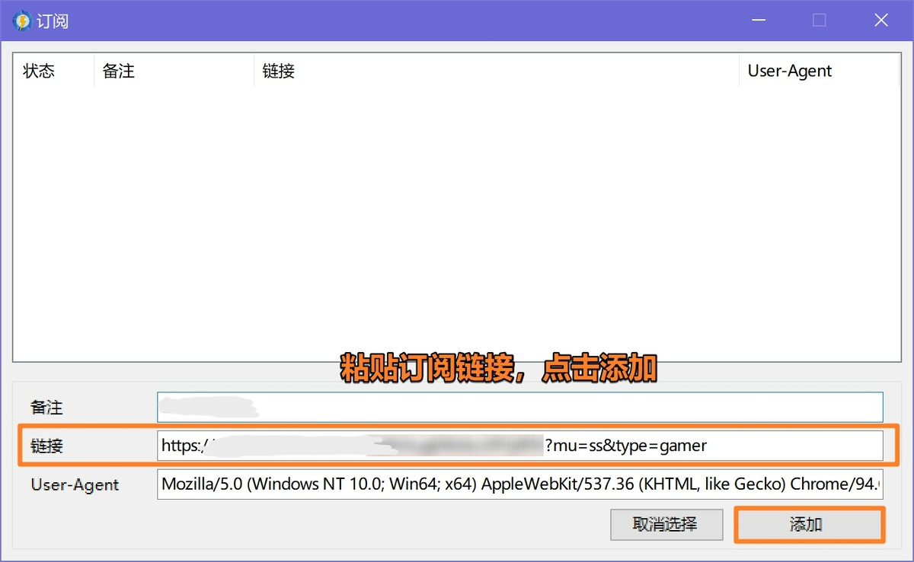

# Netch (Gaming/Special)

[Netch](https://github.com/netchx/netch/releases/download/1.9.7/Netch.7z) is an open-source game acceleration tool for Windows that proxies processes by scanning game directories.

## System Requirements

- Windows 7 or above (32/64-bit)
- Windows PC / Tablet

## ⚠️ Important Notes
>
> - Although Netch claims to be designed for gaming, its underlying protocol is not specifically designed for games and may not meet high-performance gaming requirements
> - It is recommended to turn off Netch when using BitTorrent protocol to avoid violating service provider terms

## Usage Guide

## Update History

*Last updated: November 16, 2024*
