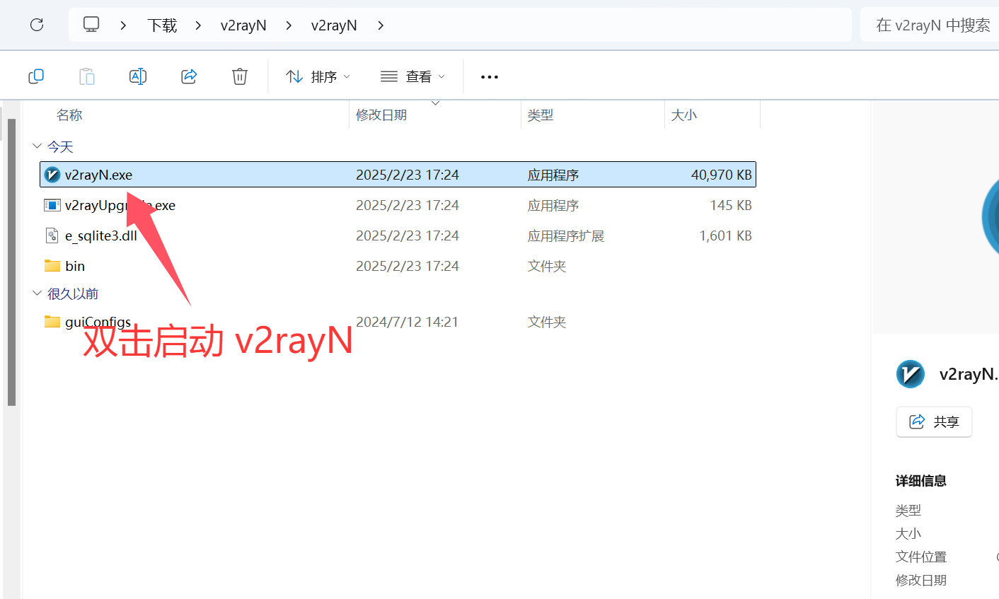
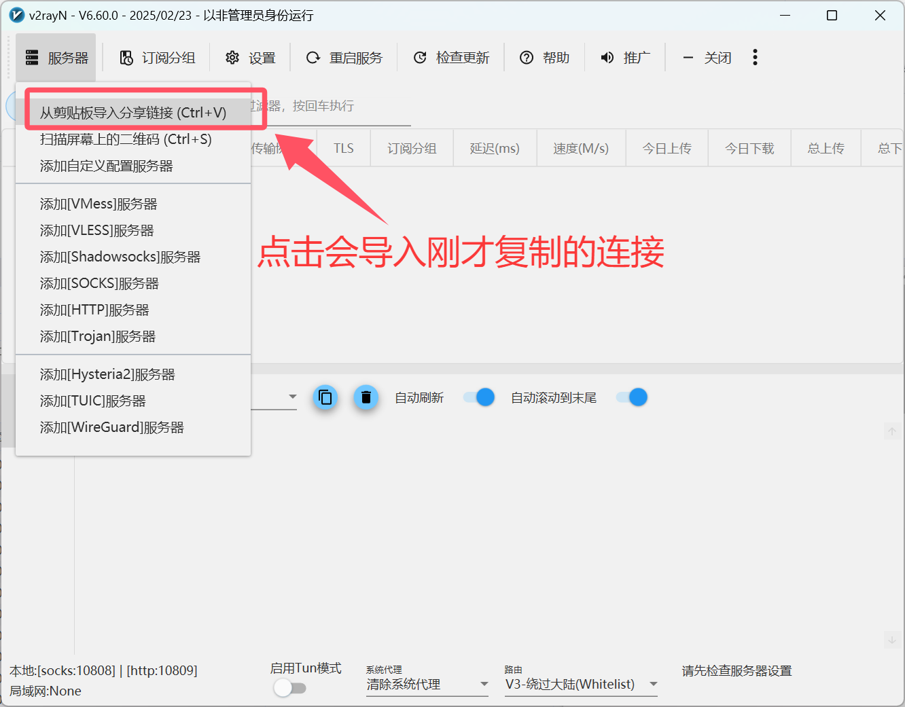
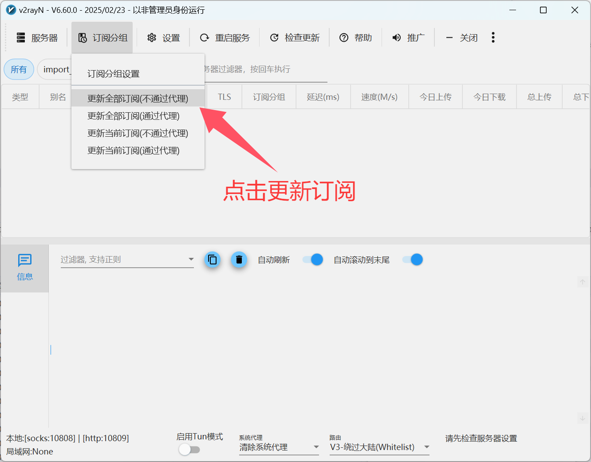
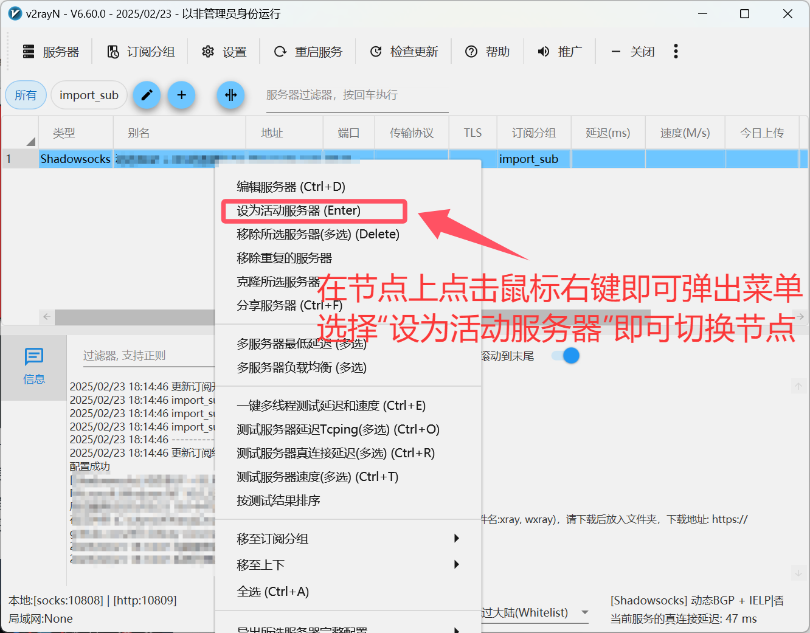
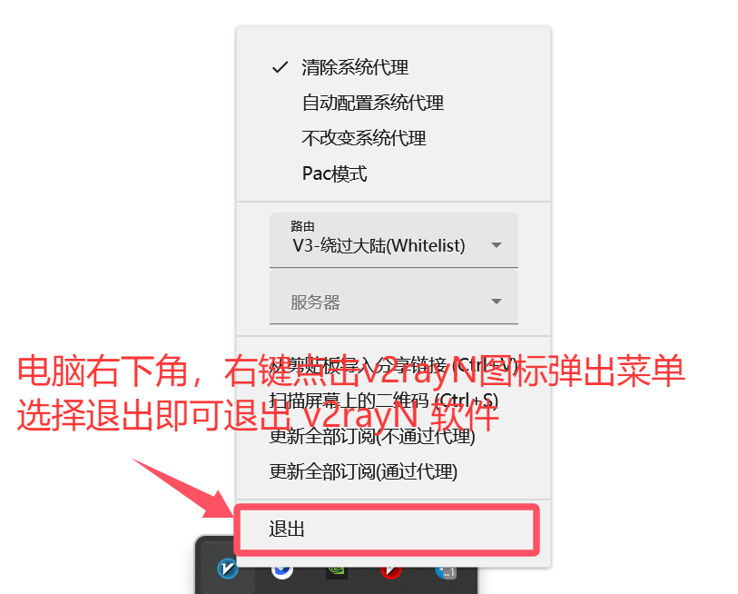

# v2rayN for Windows

[v2rayN](https://github.com/2dust/v2rayN/releases/download/6.60/v2rayN.zip) is a graphical client for V2Ray on Windows systems. It supports multiple proxy protocols (SS, SSR, Socks, Snell, V2Ray, Trojan, etc.).

## Download

[Download Address 1](https://git.886.be/https://github.com/2dust/v2rayN/releases/download/6.60/v2rayN.zip)

[Download Address 2](https://gh.xxooo.cf/https://github.com/2dust/v2rayN/releases/download/6.60/v2rayN.zip)

[Download Address 3](https://github.com/2dust/v2rayN/releases/download/6.60/v2rayN.zip)

## System Requirements

- Windows 10 and above (64-bit)

## Usage Guide

### 1. Launch v2rayN

Extract the downloaded v2rayN to any directory, then double-click `v2rayN.exe` to launch.

### 2. Copy Subscription Link

### 3. Import Subscription Link

### 4. Update Subscription Nodes

### 5. Enable Proxy

### 6. Switch Nodes

### 7. Disable Proxy

## Update History

*Last updated: February 23, 2025*