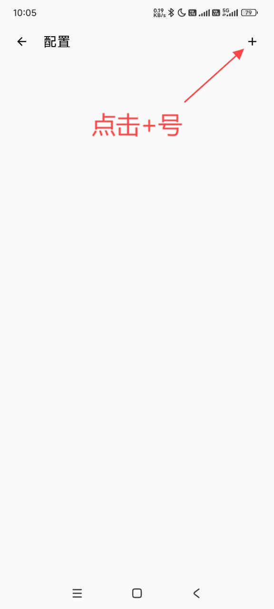
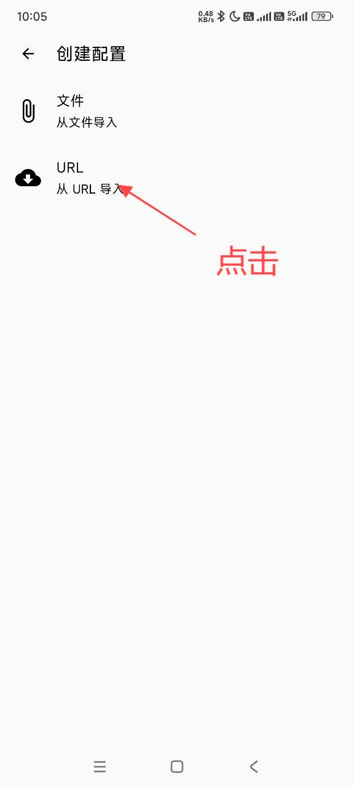
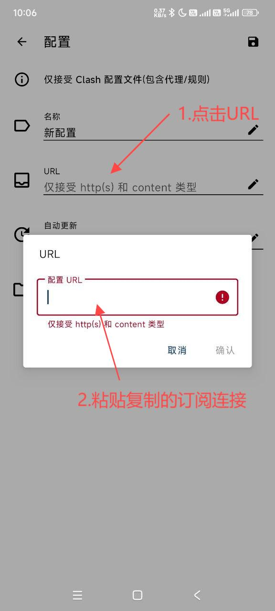
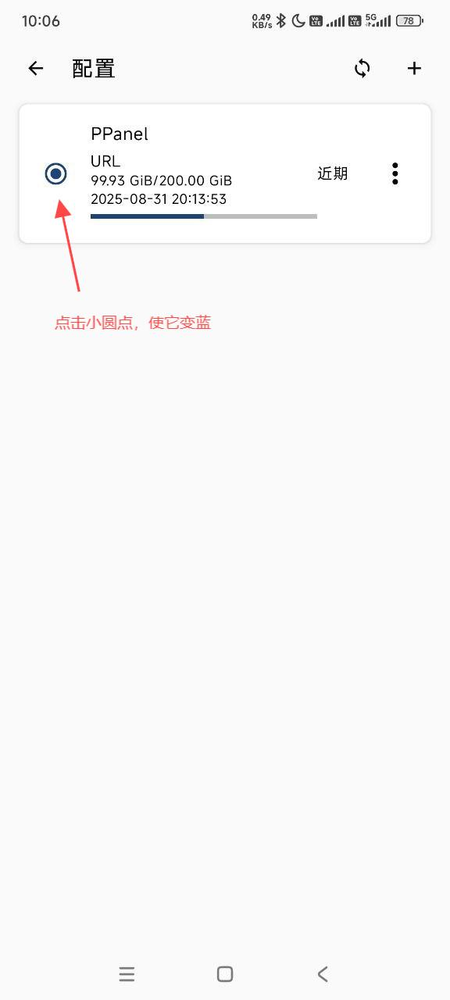
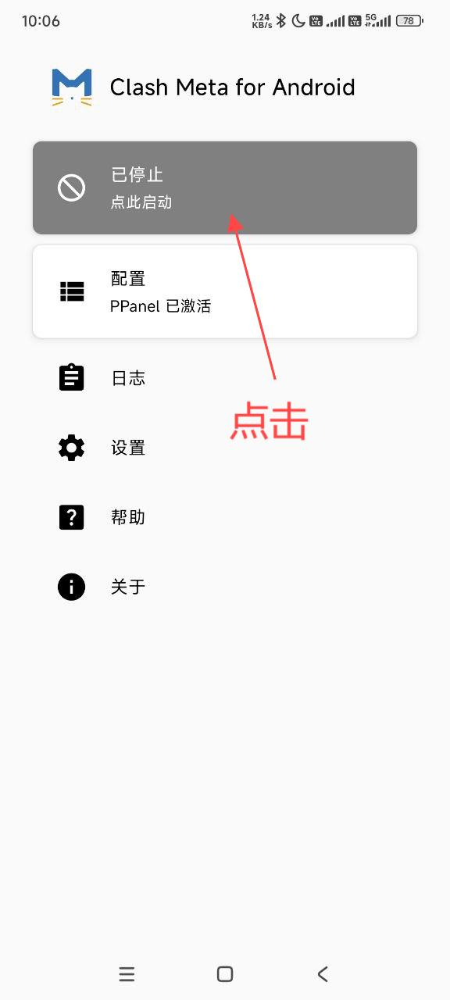
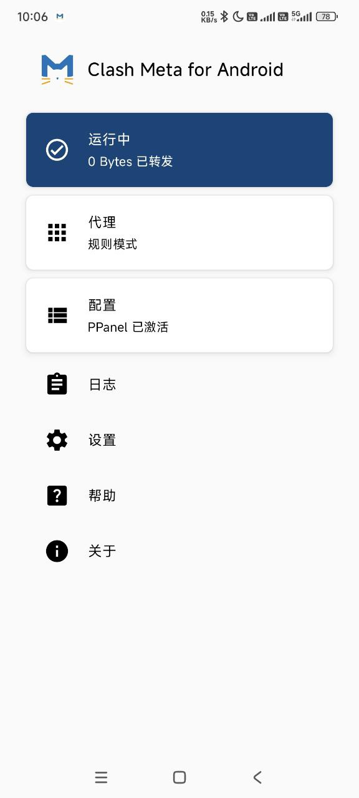

# Clash Meta for Android

## 产品介绍

[Clash Meta for Android](https://github.com/MetaCubeX/ClashMetaForAndroid) 是一款基于 Clash Meta 项目开发的安卓版本代理工具，具有强大的功能特性和稳定的性能表现。

### 支持协议

- Shadowsocks (SS)
- ShadowsocksR (SSR)
- Socks
- Snell
- V2Ray
- Trojan

## 环境要求

- 系统版本：Android 7.0+
- 适用设备：安卓手机/平板

## 下载地址

[下载地址1](https://git.886.be/https://github.com/MetaCubeX/ClashMetaForAndroid/releases/download/Prerelease-alpha/cmfa-2.11.6-alpha-universal-release.apk)

[下载地址2](https://gh.xxooo.cf/https://github.com/MetaCubeX/ClashMetaForAndroid/releases/download/Prerelease-alpha/cmfa-2.11.6-alpha-universal-release.apk)

[下载地址3](https://tagcloud.lanzouw.com/i02u02b85x8d)

[下载地址4](https://github.com/MetaCubeX/ClashMetaForAndroid/releases/download/Prerelease-alpha/cmfa-2.11.6-alpha-universal-release.apk)

## 使用指南

### 配置步骤

1. 下载并安装应用
2. 启动 Clash Meta
3. 导入配置信息
4. 选择代理节点
5. 开启连接服务

### 操作图解

---
*更新时间：2024.11.16*
