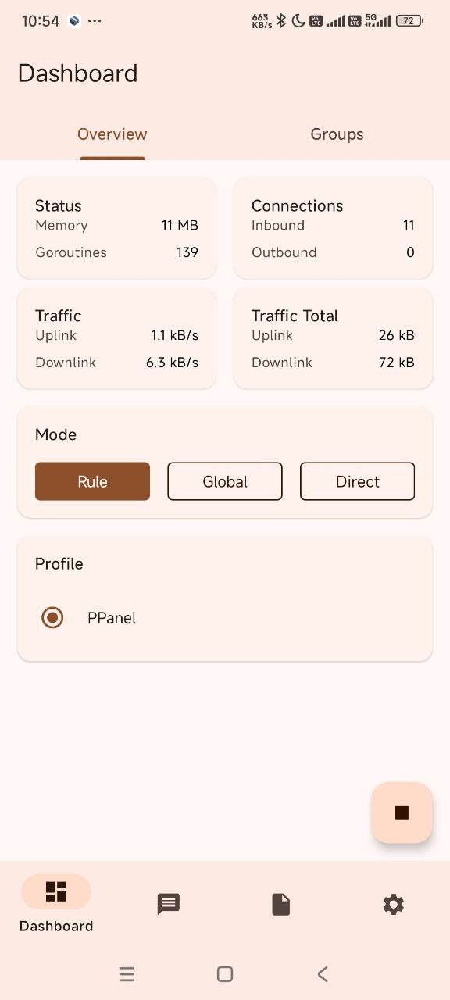

# Sing-box

## 简介

[Sing-box](https://github.com/SagerNet/sing-box/releases/download/v1.10.1/SFA-1.10.1-universal.apk) 是新一代通用跨平台代理软件客户端，支持多平台且完全免费，包括 iOS 和 Apple TV。

### 主要特点

- 跨平台支持
- 开源免费
- 持续更新维护
- 性能优异

### 支持协议

- Shadowsocks
- VMess
- Trojan
- Hysteria 2

## 系统要求

- 操作系统：Android 5.0 及以上
- 适用设备：安卓手机/平板

## 使用指南

### 配置步骤

1. 下载并安装应用
2. 打开 Sing-box
3. 导入配置文件
4. 选择服务器
5. 启动连接

### 详细图解

---
*最后更新：2024.11.16*
