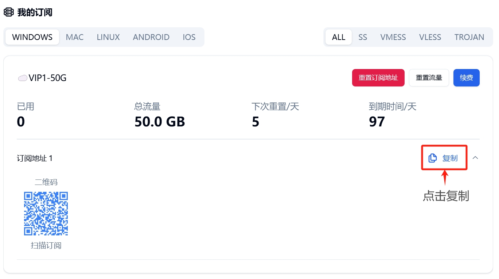
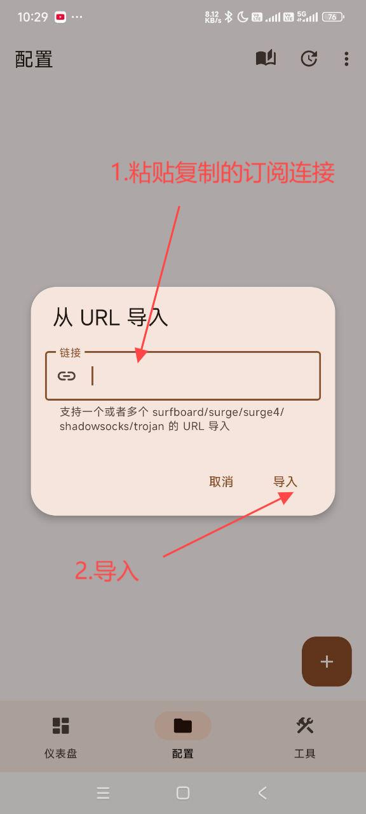
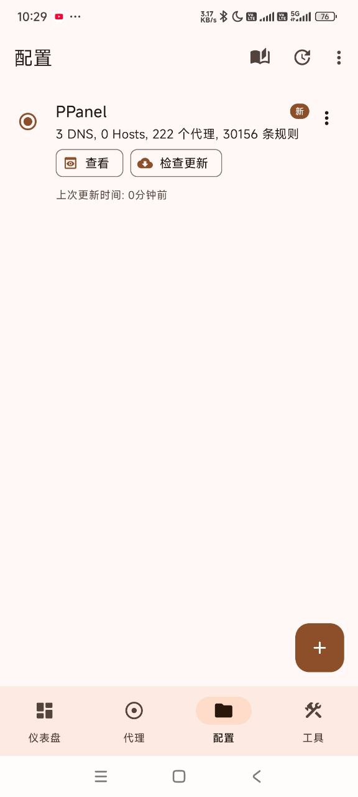
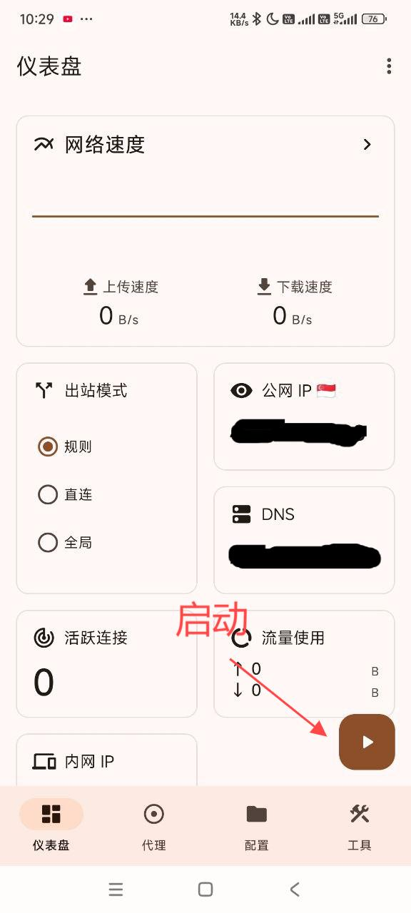

# Surfboard

## 简介

[Surfboard](https://github.com/getsurfboard/surfboard) 是一款性能优秀、界面美观的安卓代理工具，完全兼容 Surge 配置。

### 支持协议

- Shadowsocks (SS)
- V2Ray (VMess)
- Trojan
- HTTP/HTTPS
- SOCKS5
- SOCKS5 over TLS

## 系统要求

- 操作系统：Android 9.0 及以上
- 适用设备：安卓手机/平板

## 下载地址

[下载地址1](https://git.886.be/https://github.com/getsurfboard/surfboard/releases/download/2.24.5/mobile-universal-release.apk)

[下载地址2](https://gh.xxooo.cf/https://github.com/getsurfboard/surfboard/releases/download/2.24.5/mobile-universal-release.apk)

[下载地址3](https://github.com/getsurfboard/surfboard/releases/download/2.24.5/mobile-universal-release.apk)

## 配置教程

### 导入步骤

1. 打开 Surfboard 应用
2. 点击右上角菜单
3. 选择配置来源
4. 导入配置文件
5. 选择节点并连接

### 图文说明

---
*文档更新：2024.11.16*
