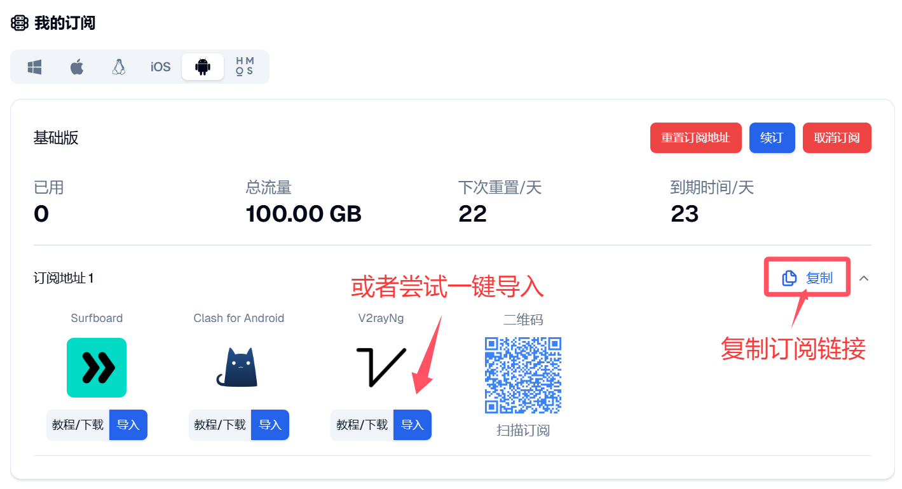
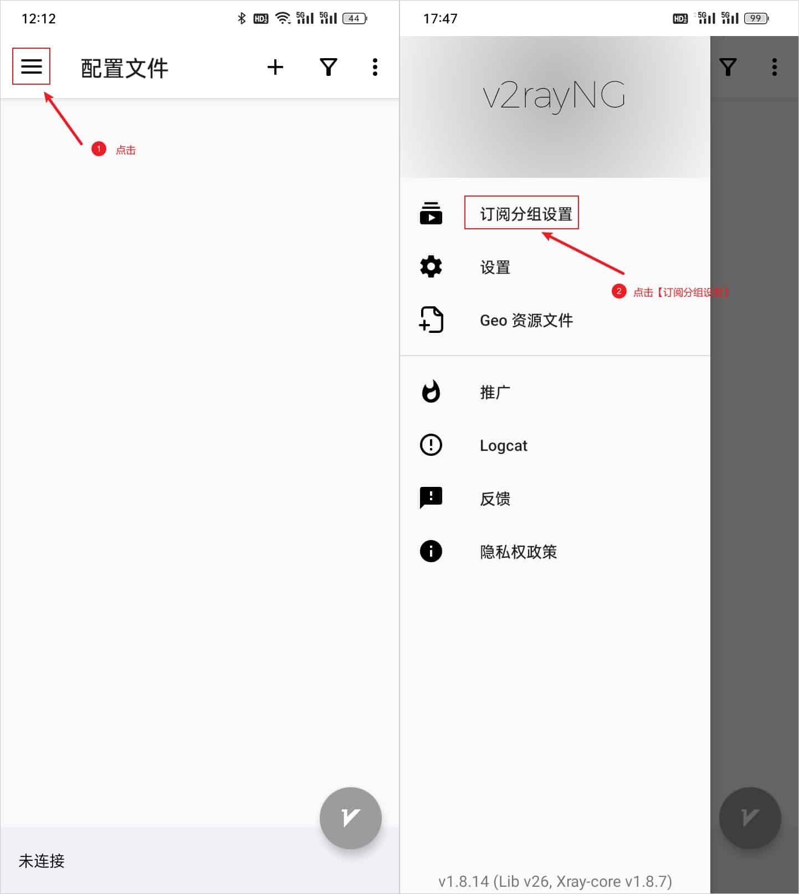
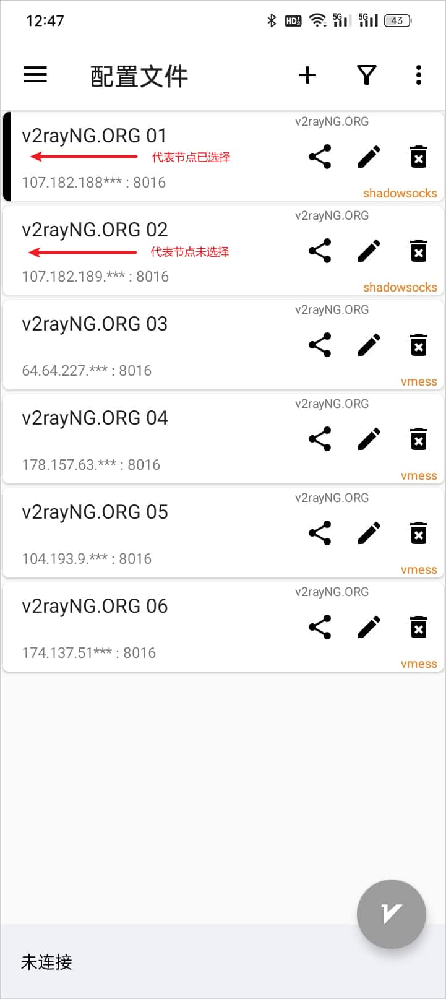

# v2rayNG

[v2rayNG](https://github.com/2dust/v2rayNG) 是 Android 系统即安卓手机系统下的代理软件客户端，功能强大且支持多种代理协议。

## 支持协议

- VMess
- VLESS
- Shadowsocks
- Socks
- Trojan
- Wireguard

## 系统要求

- 操作系统：Android 5.0 及以上
- 适用设备：安卓手机/平板

## 下载地址

[下载地址1](https://git.886.be/https://github.com/2dust/v2rayNG/releases/download/1.9.33/v2rayNG_1.9.33_universal.apk)

[下载地址2](https://gh.xxooo.cf/https://github.com/2dust/v2rayNG/releases/download/1.9.33/v2rayNG_1.9.33_universal.apk)

[下载地址3](https://github.com/2dust/v2rayNG/releases/download/1.9.33/v2rayNG_1.9.33_universal.apk)

[下载地址4](https://dl.v2rayng.org/releases/latest/v2rayNG_1.8.12.apk)

## 安装教程

安装教程很简单，如果是通过应用商店下载的，那么直接根据提示下载并安装即可，如果是通过官网下载或其他第三方下载的，下载完后获得文件为 v2rayNG_x.x.x.apk 文件，其中后缀 .apk 为安卓系统的安装包，x.x.x 代表版本号，然后点击安装即可，十分简单。

安装完后，打开软件进入主界面，即配置文件界面，如下图所示。

## 使用教程

### 1. 导入订阅链接

复制订阅链接

点击右上角的导入按钮，选择订阅链接，然后点击确定，即可导入订阅链接。

### 2. 更新订阅节点

### 3. 连接节点

