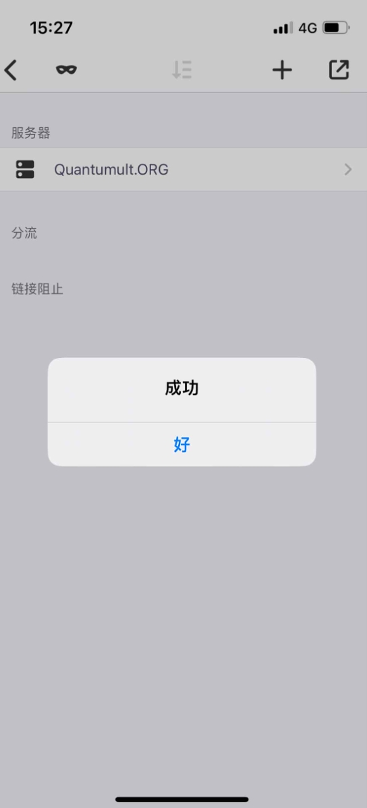

# Quantumult - 经典网络工具

Quantumult 是 Quantumult X 的经典版本，提供稳定可靠的基础功能。

## 功能特点

- 支持主流协议：SS、SSR、VMess、Trojan
- 基础分流功能
- 简单的策略组配置
- 稳定的性能表现
- 低内存占用

## 基本信息

- **系统要求**：iOS 9.0 或更高版本
- **兼容设备**：iPhone / iPad

> ⚠️ **注意事项**
>
> - 该应用在中国大陆 App Store 未上架
> - 需要非中国大陆 Apple ID 下载

## 使用教程

### 配置导入

---

最新更新于 2024.11.17
