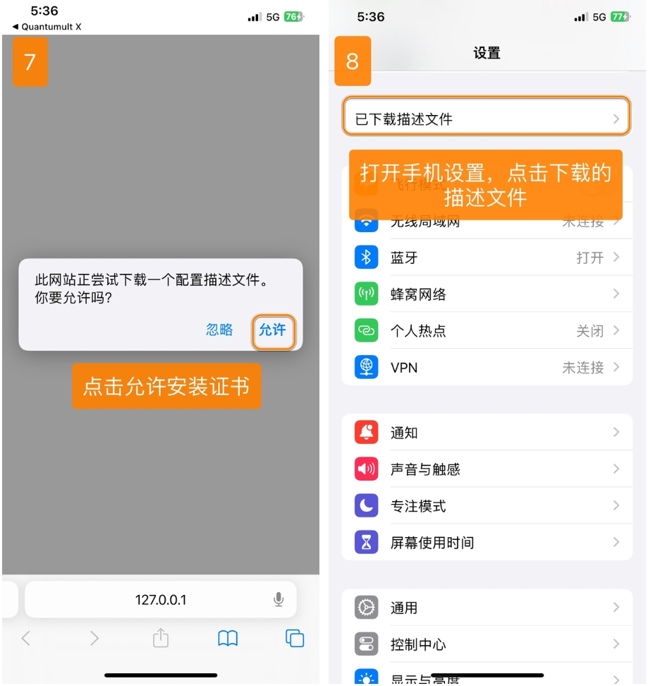
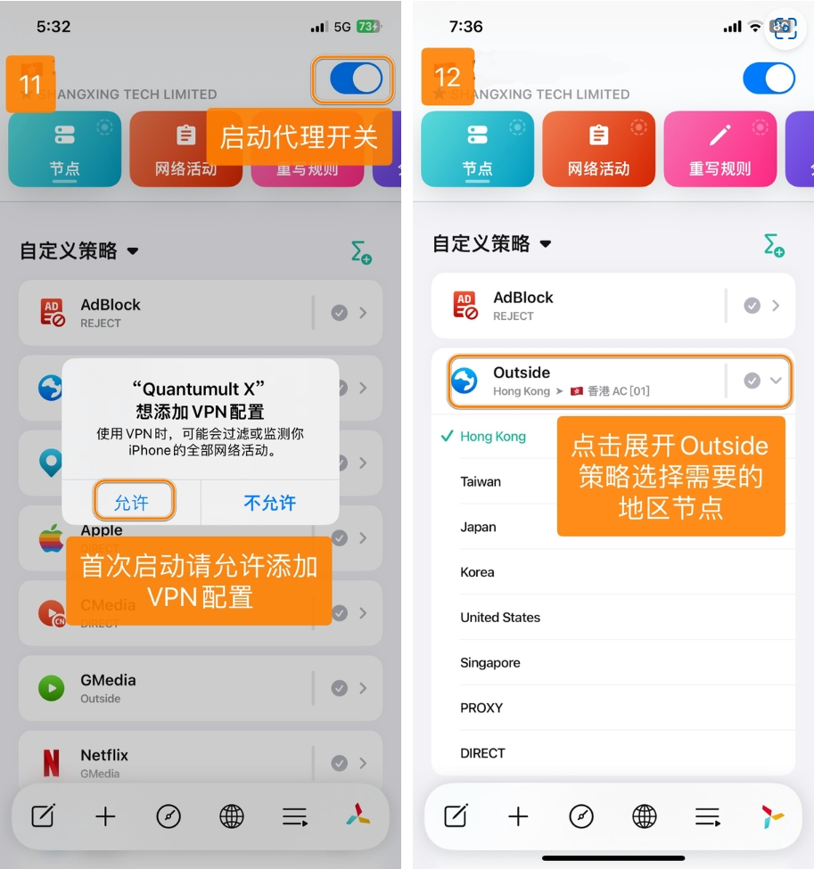
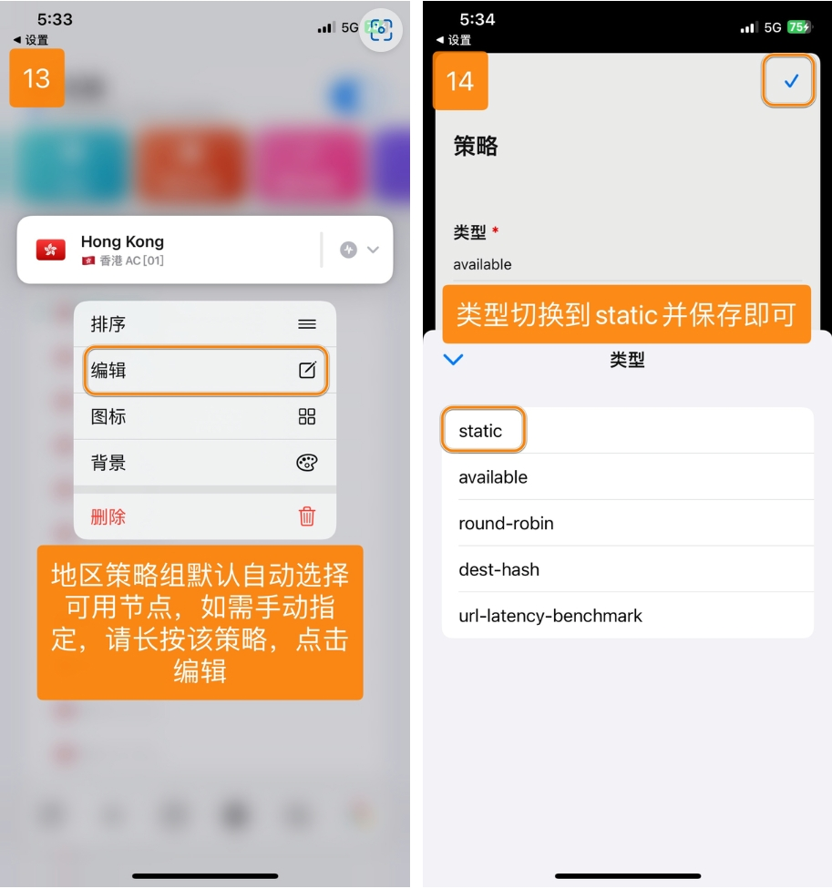

# Quantumult X - 高级网络工具平台

Quantumult X 是一个功能丰富的网络工具平台，提供强大的自定义能力和丰富的扩展功能。

## 功能特点

- 多协议支持：SS、SSR、VMess、Trojan
- 高度可定制的分流系统
- 强大的重写功能
- JavaScript 脚本支持
- 策略组动态切换
- 支持 Gallery 功能

## 基本信息

- **系统要求**：iOS 13.0 或更高版本
- **兼容设备**：iPhone / iPad

> ⚠️ **注意事项**
>
> - 该应用在中国大陆 App Store 未上架
> - 需要非中国大陆 Apple ID 下载

> ⚠️ **重要提示**

- 请注意，iOS 的 Quantumult X 为付费软件，需要您自行购买使用
- 对于此软件，我们没有提供规则配置、脚本以及进阶使用方法等，受限于我们客服的经验、知识储备，我们仅能提供您基本的导入订阅打开代理的教程，进阶使用方法需要您自行搜索相关资料学习，我们暂无法提供，望您理解

## 使用教程

### 配置导入

---

### 自定义策略

---

### 更新配置

---

最新更新于 2024.11.17
