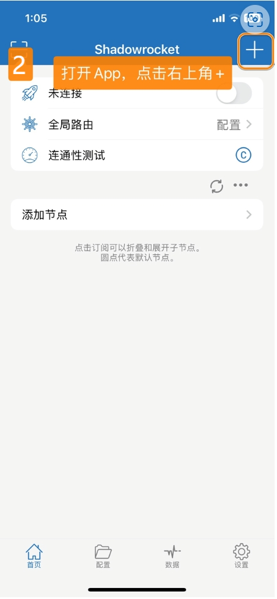
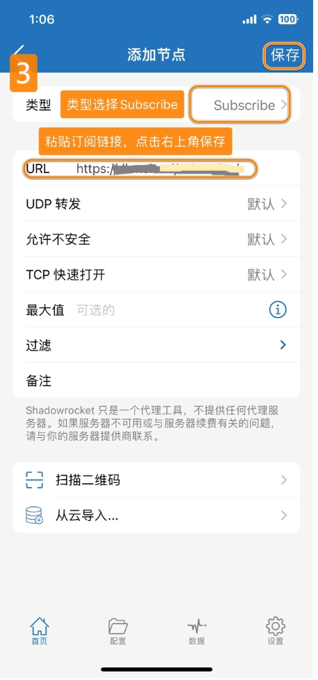
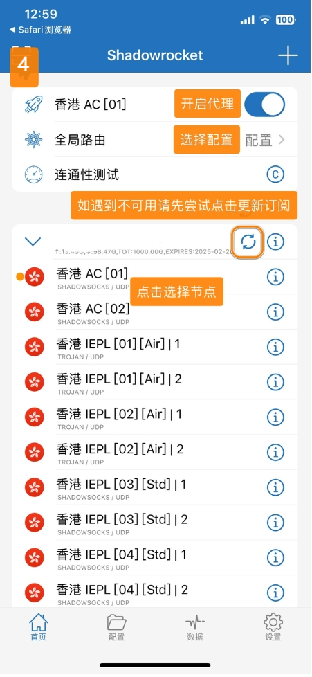

# Shadowrocket - 轻量级网络工具

Shadowrocket（小火箭）是一款轻量级但功能强大的网络工具，以其简洁的界面和稳定的性能著称。

## 功能特点

- 多协议支持：SS、SSR、V2Ray、Xray、Trojan
- 简洁直观的用户界面
- 规则分流系统
- 支持脚本功能
- 较低的资源占用

## 基本信息

- **系统要求**：iOS 9.0 或更高版本
- **兼容设备**：iPhone / iPad

> ⚠️ **注意事项**
>
> - 该应用在中国大陆 App Store 未上架
> - 需要非中国大陆 Apple ID 下载

## 使用教程

### 配置导入

---

最新更新于 2024.11.17
