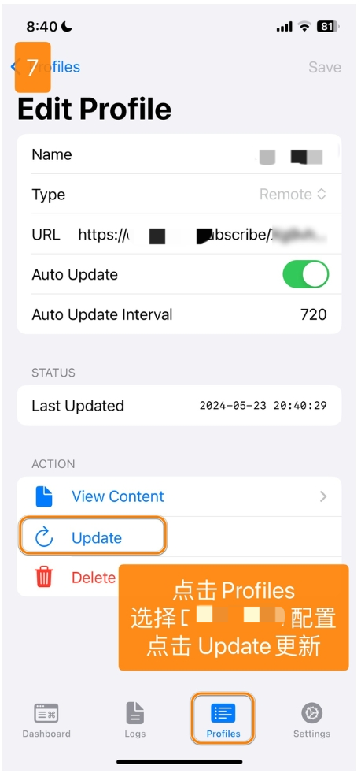

# Sing-box - 新一代通用代理工具

Sing-box 是一个通用代理工具，采用 Go 语言开发，具有高性能、跨平台的特点。

## 功能特点

- 全协议支持：Shadowsocks、VMess、Trojan 等
- 内置 DNS 服务器
- TUN 模式支持
- 灵活的路由系统
- 实时流量监控

## 基本信息

- **系统要求**：iOS 15.0 或更高版本
- **兼容设备**：iPhone / iPad

> ⚠️ **注意事项**
> - 该应用在中国大陆 App Store 未上架
> - 需要非中国大陆 Apple ID 下载

> ⚠️ **重要提示**

- 请注意，iOS 的 Sing-box 为付费软件，需要您自行购买使用
- 请留意，此软件是较为专业的软件，我们仅提供基础使用教程，并不能提供故障排查、进阶使用支持等协助，望理解

## 使用教程

### 配置导入

---
### 更新配置

---
最新更新于 2024.11.17
