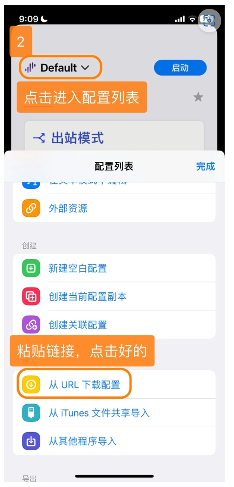
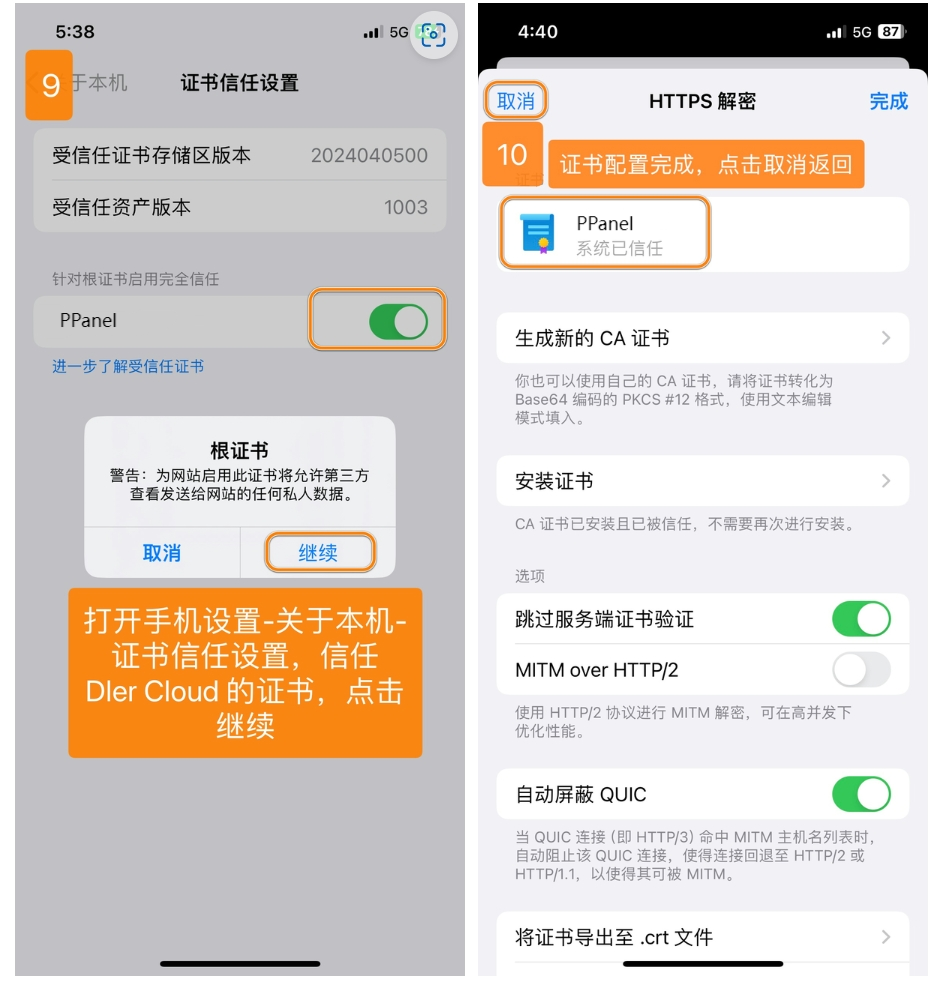

# Surge - 专业级 iOS 网络工具

Surge 是一款功能强大的网络工具平台，不仅是一个代理工具，更是一个功能完整的网络调试工具。

## 功能特点

- 支持多种代理协议：SS、VMess、Trojan、Snell 等
- 强大的规则系统
- 实时网络监控
- 支持 MitM、脚本功能
- 高性能且节能的架构设计

## 基本信息

- **系统要求**：iOS 9.0 或更高版本
- **兼容设备**：iPhone / iPad
- **软件版本**：Surge 2/3/4/5

> ⚠️ **注意事项**
>
> - 该应用在中国大陆 App Store 未上架
> - 需要非中国大陆 Apple ID 下载
> - 不支持 SSR 协议

> ⚠️ **重要提示**

- 请注意，iOS 的 Surge 为付费软件，需要您自行购买使用，但软件本身提供了7天试用
- 请留意，此软件是较为专业的软件，我们仅提供基础使用教程，并不能提供故障排查、进阶使用支持等协助，望理解

## 使用教程

### 配置导入

---

### 更新配置

---

最新更新于 2024.11.17
