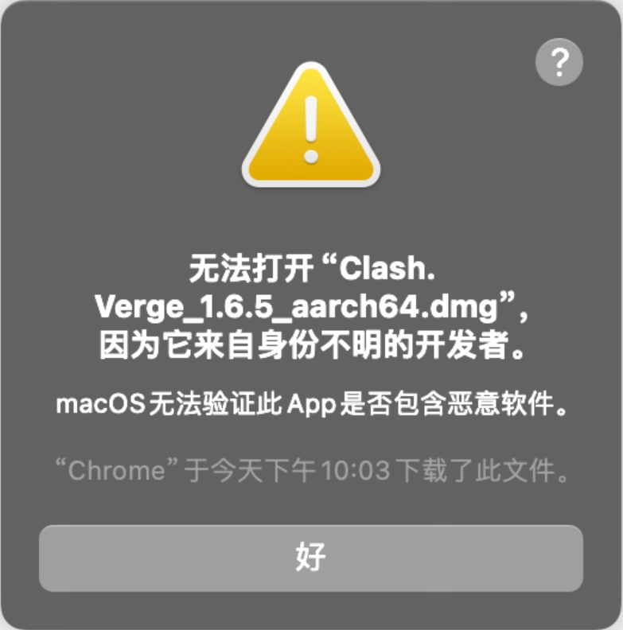
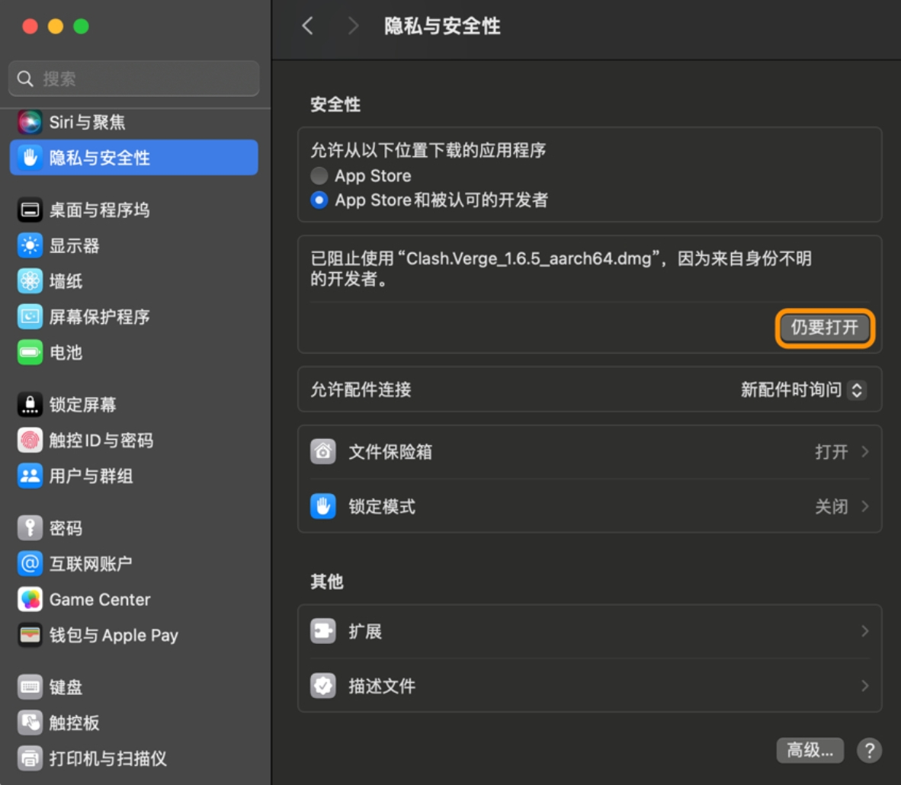
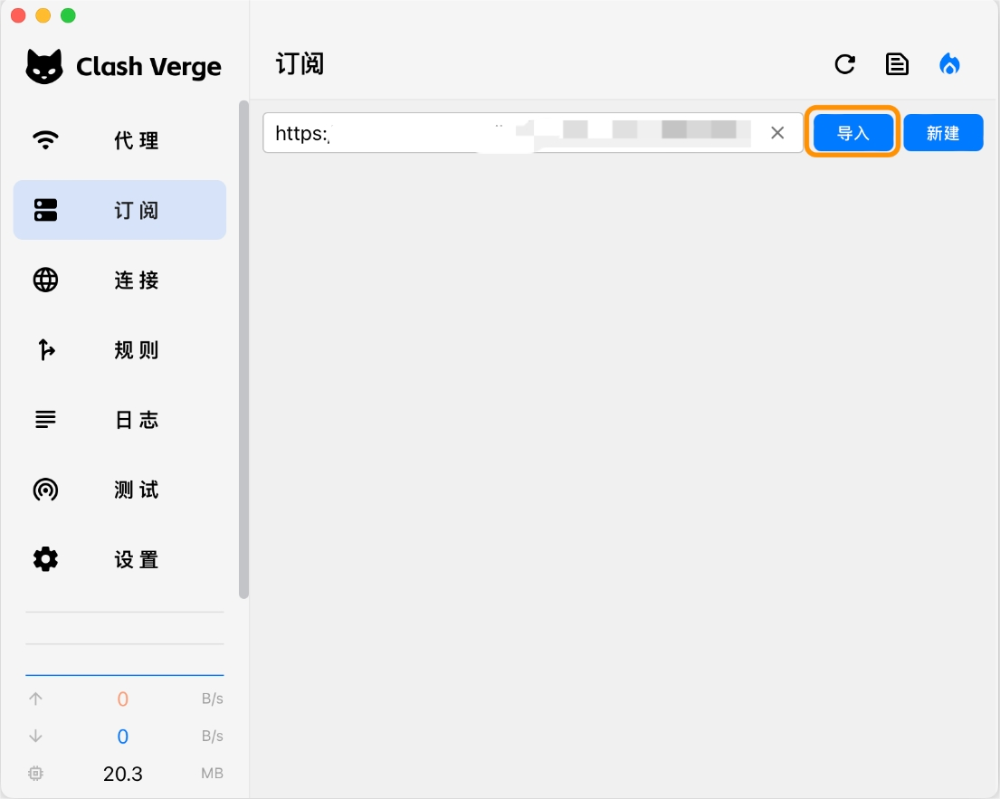
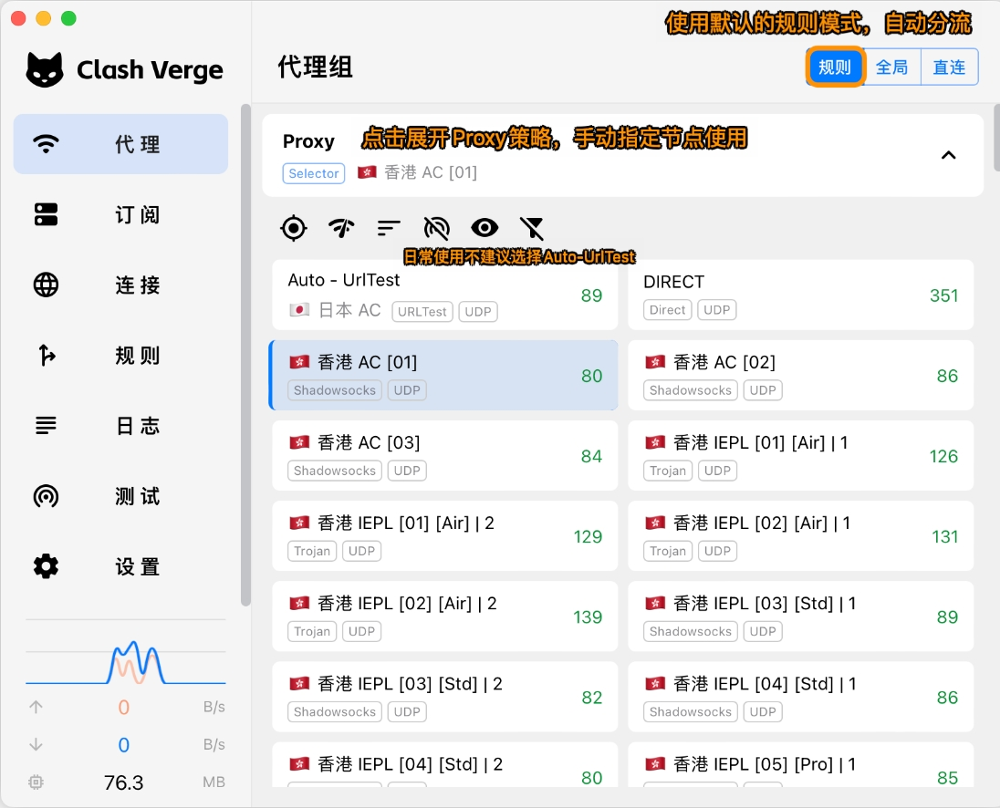
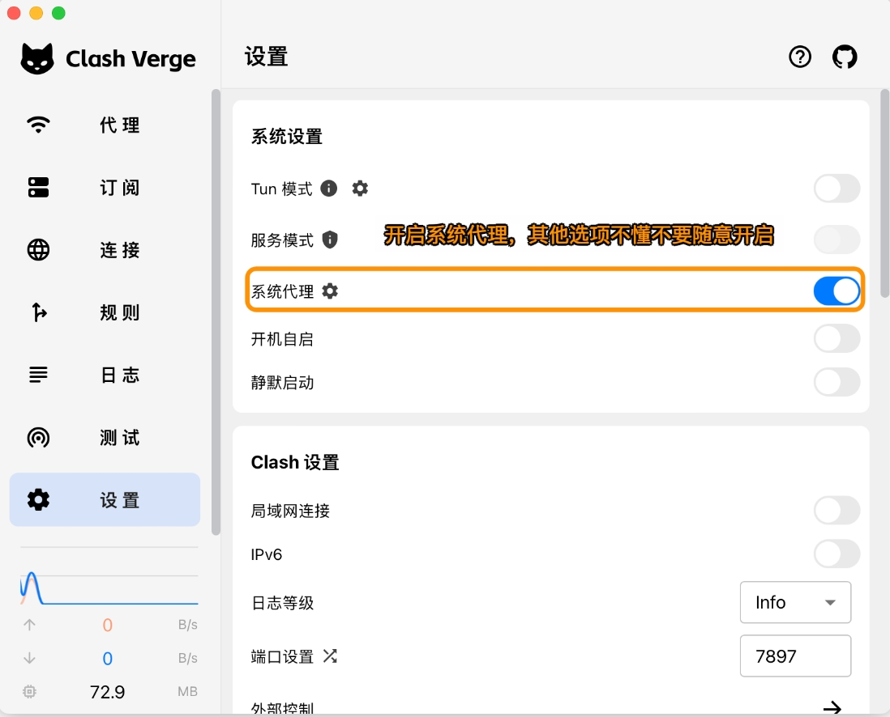
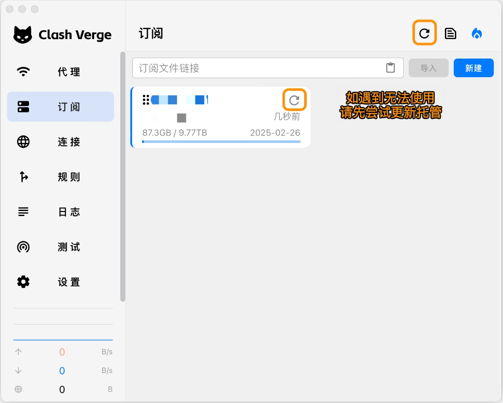

# Clash Verge

[Clash Verge](https://github.com/clash-verge-rev/clash-verge-rev/releases/download/v1.7.7/Clash.Verge_1.7.7_aarch64.dmg) 是 Clash 内核的跨平台图形界面客户端，支持 Windows、Linux、macOS 系统，具有强大的分流规则功能。

## 使用须知

> ⚠️ 运行环境要求

- 系统版本：macOS 10.5 或更高版本
- 软件版本：Clash Verge for macOS
- 适用设备：MacBook / iMac / Mac Pro

### 重要提示

📢 macOS 安全性提示解决方案
从 macOS 10.15 开始，由于系统安全性增强，首次运行可能提示"无法验证开发者"或"应用程序已损坏"。请按以下步骤操作：

---

## 配置教程

### 1. 导入配置

---

### 2. 更新配置

---

*文档更新日期：2024.11.17*
