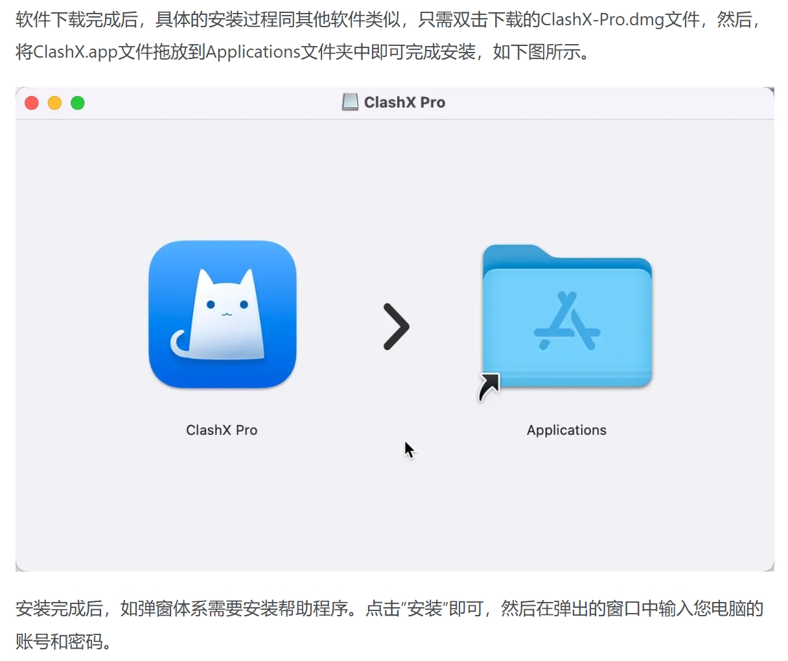
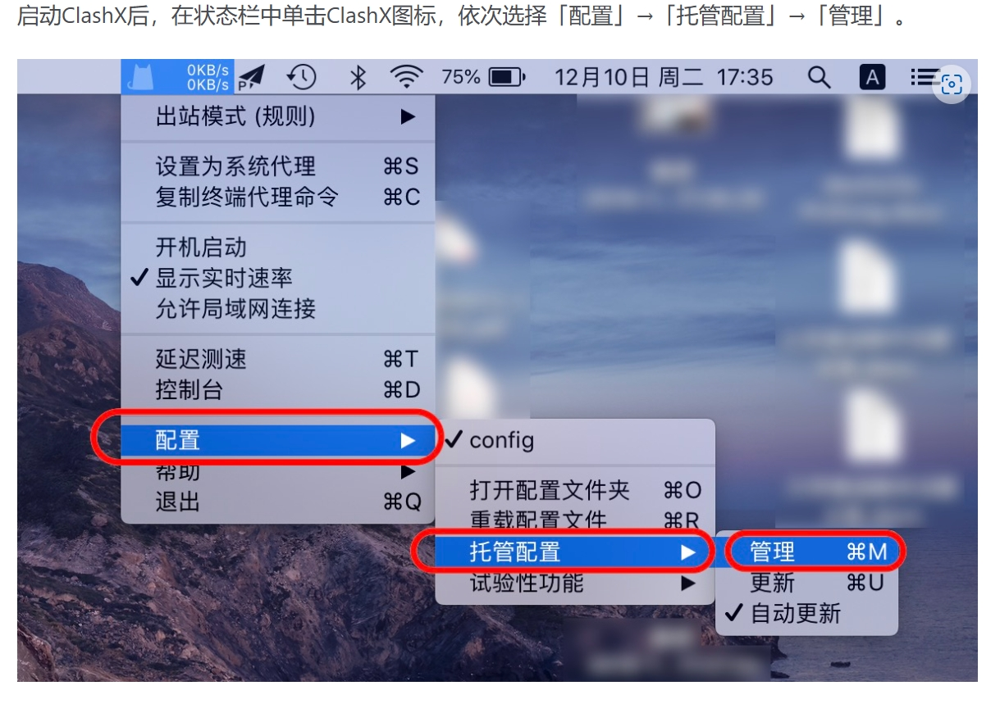
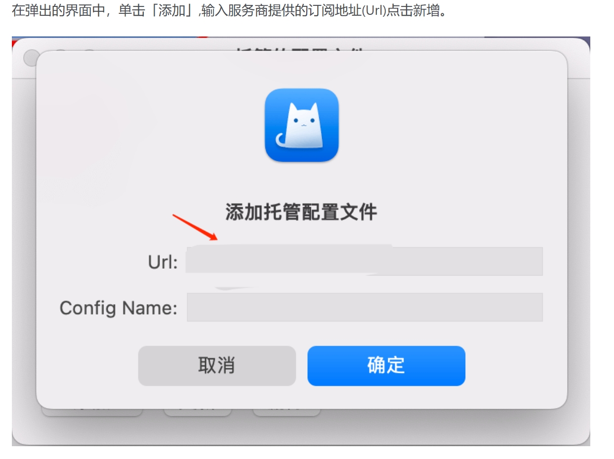
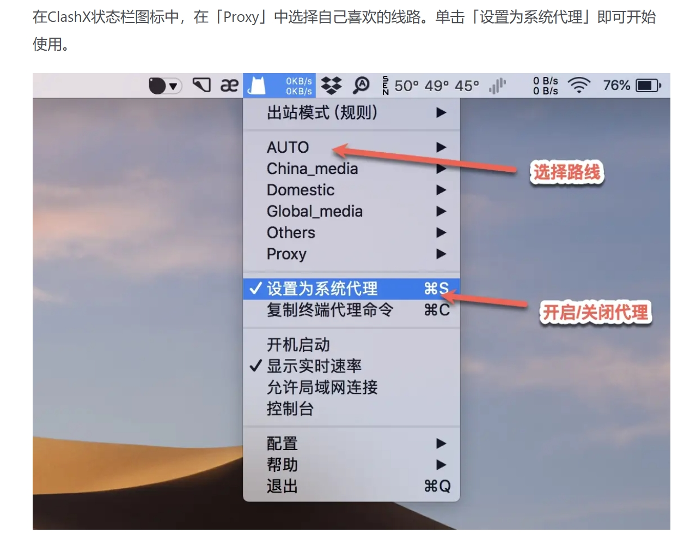

# ClashX Pro

[ClashX Pro](https://clashxhub.com/apps/ClashXPro.dmg) 是一款现代化的 macOS 代理工具，支持：

- Shadowsocks (SS)
- V2Ray (VMess)
- Trojan
- HTTP/HTTPS
- SOCKS5
- SOCKS5 over TLS

## 下载地址

[下载地址1](https://clashxhub.com/apps/ClashXPro.dmg)

[下载地址2](https://dl.haojichang.com/apps/ClashX_Pro/ClashXPro.dmg)

[下载地址3](https://krakenfiles.com/view/5RdlIY2HKL/file.html)

## 使用须知

> ⚠️ 运行环境要求

- 系统版本：macOS 10.5 或更高版本
- 软件版本：ClashX Pro for macOS
- 适用设备：MacBook / iMac / Mac Pro

## 配置教程

### 1. 软件安装

---

### 2. 导入配置

---

*文档更新日期：2024.11.17*
