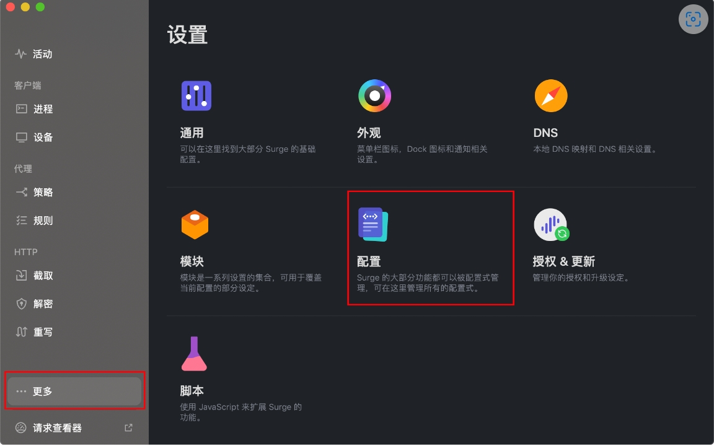
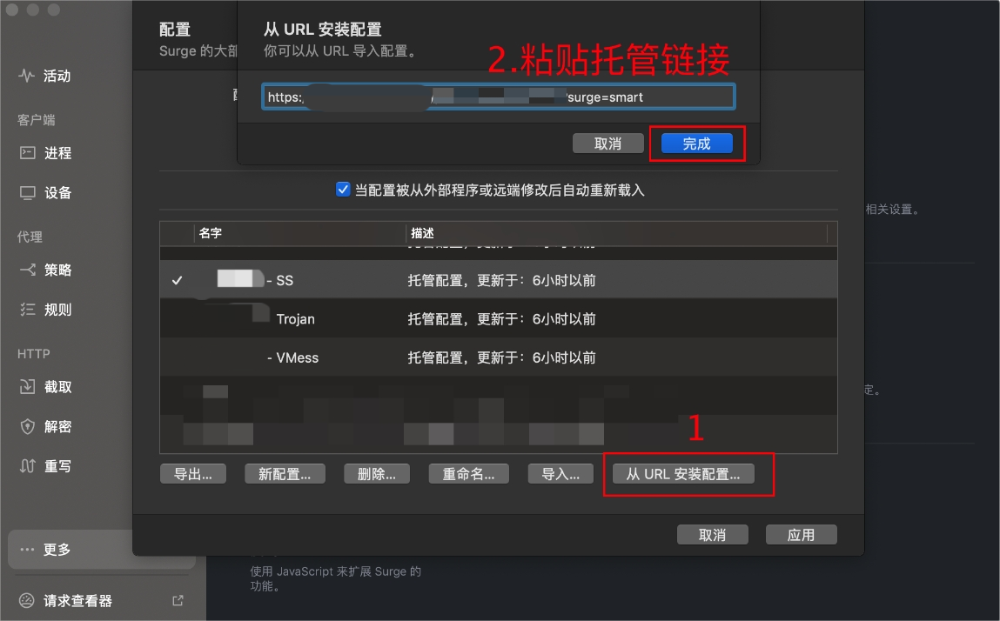
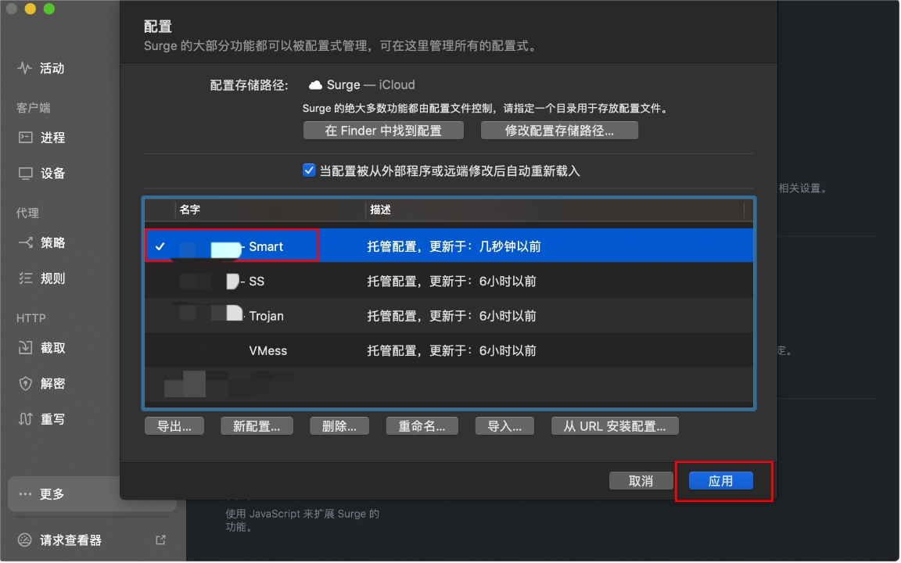
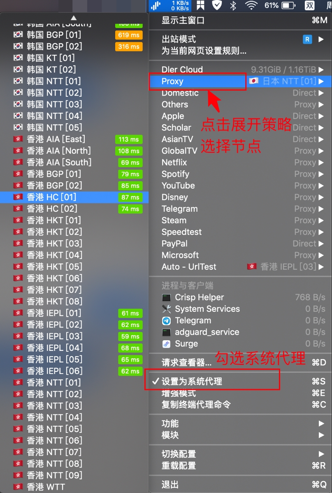

# Surge Pro

[Surge Pro](https://nssurge.com/buy_now) 是一款功能强大的 macOS 网络工具，支持多种代理协议：

- Shadowsocks (SS)
- V2Ray (VMess)
- Trojan
- HTTP/HTTPS
- SOCKS5
- Snell
- SOCKS5 over TLS

## 使用须知

> ⚠️ 运行环境要求

- 系统版本：macOS 10.5 或更高版本
- 软件版本：Surge 3+ for macOS
- 适用设备：MacBook / iMac / Mac Pro

## 配置教程

### 导入配置步骤

---
*文档更新日期：2024.11.17*
