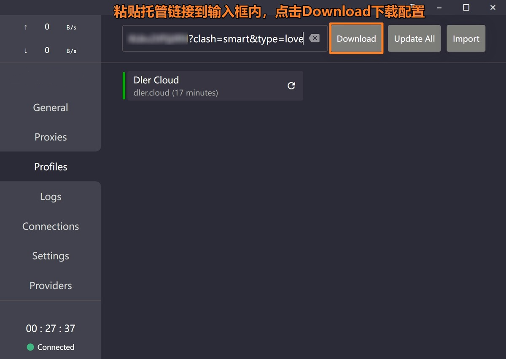
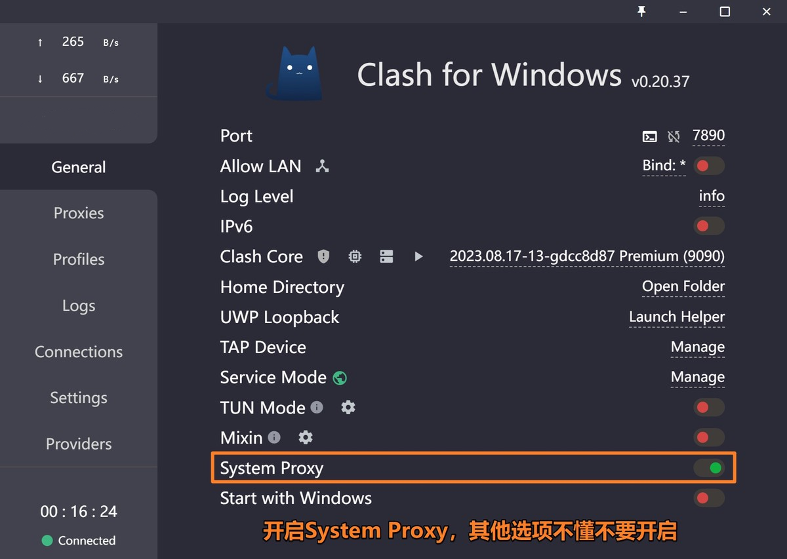
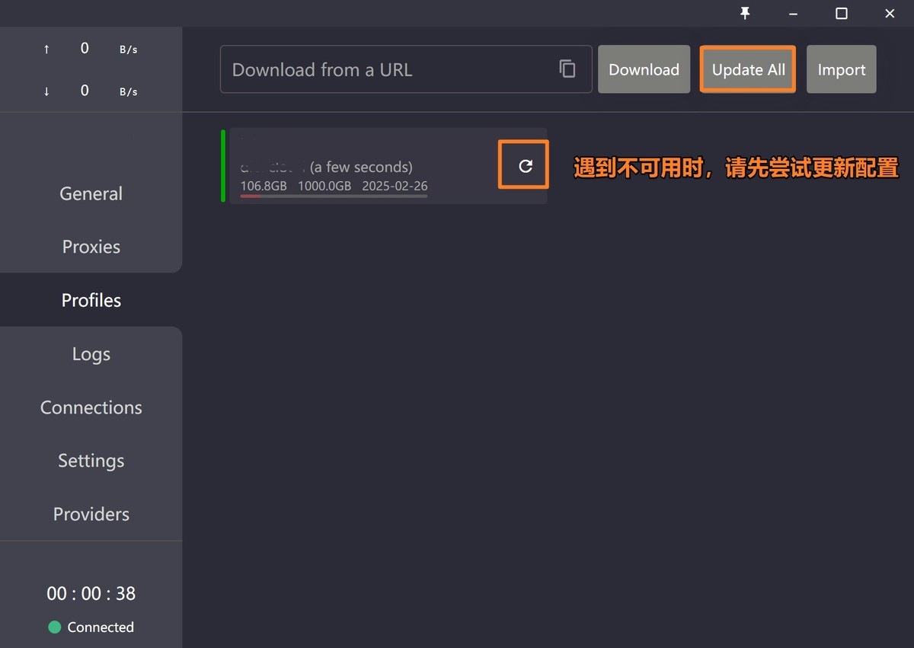

# Clash for Windows

[Clash for Windows](https://github.com/clashdownload/Clash_for_Windows/releases/download/0.20.39/Clash.for.Windows.Setup.0.20.39.exe) 是 Clash 在 Windows 系统上的官方图形客户端，支持 Windows、Linux、macOS 三大系统，支持多种代理协议（SS、SSR、Socks、Snell、V2Ray、Trojan 等）。

## 系统要求

- Windows XP 及以上（64-bit）
- Windows PC / Tablet

## ⚠️ 首次运行提示
>
> Windows 10 用户首次运行时可能会看到安全提示，请按以下步骤操作：
>
> 1. 点击「更多信息」
> 2. 点击「仍要运行」

## 使用教程

### 1. 导入配置

### 2. 更新配置

## 更新记录

*最后更新: 2024年11月16日*
