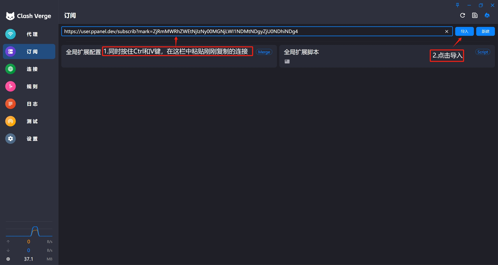
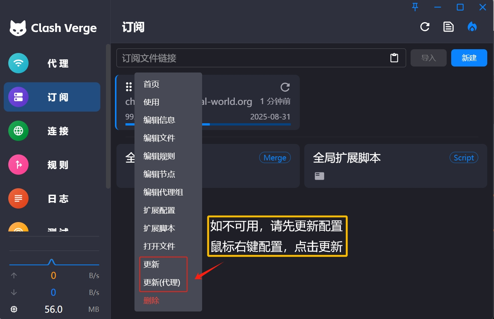

# Clash Verge

[Clash Verge](https://github.com/clash-verge-rev/clash-verge-rev) 是代理工具 Clash 内核的 GUI 图形客户端，支持 Windows、Linux、macOS 系统，分流规则功能强大且支持多种代理协议。

## 系统要求

- Windows 7 及以上（32/64-bit）
- Windows PC / Tablet

## 下载地址

[下载地址1](https://github.com/clash-verge-rev/clash-verge-rev/releases/download/v1.7.7/Clash.Verge_1.7.7_x64-setup.exe)

[下载地址2](https://gh.xxooo.cf/https://github.com/clash-verge-rev/clash-verge-rev/releases/download/v1.7.7/Clash.Verge_1.7.7_x64-setup.exe)

[下载地址3](https://github.com/clash-verge-rev/clash-verge-rev/releases/download/v1.7.7/Clash.Verge_1.7.7_x64-setup.exe)

## ⚠️ 首次运行提示
>
> Windows 10 用户首次运行时可能会看到安全提示，请按以下步骤操作：
>
> 1. 点击「更多信息」
> 2. 点击「仍要运行」

## 使用教程

### 1. 导入配置

   

### 2. 更新配置

## 更新记录

*最后更新: 2024年11月16日*
