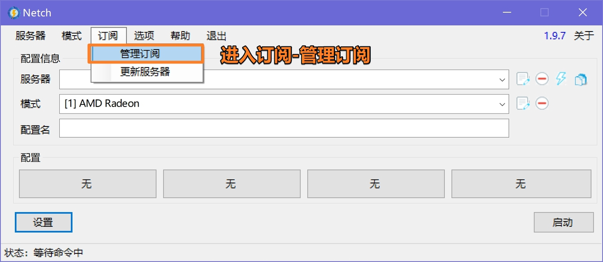
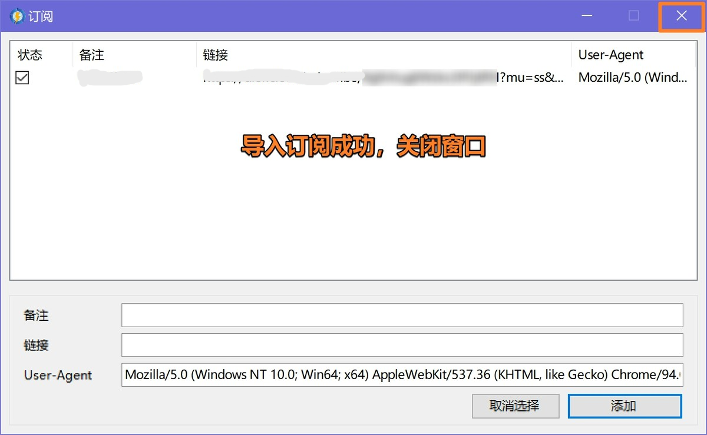

# Netch（游戏/特殊）

[Netch](https://github.com/netchx/netch/releases/download/1.9.7/Netch.7z) 是一款 Windows 平台的开源游戏加速工具，通过扫描游戏目录获得需要代理的进程名进行代理。

## 系统要求

- Windows 7 及以上（32/64-bit）
- Windows PC / Tablet

## ⚠️ 重要提示
>
> - Netch虽然宣称为游戏而生，但其底层协议并非专为游戏设计，性能可能无法满足高要求游戏需求
> - 使用 BitTorrent 协议时建议关闭 Netch，以避免触犯机场使用条款

## 使用教程

## 更新记录

*最后更新: 2024年11月16日*
