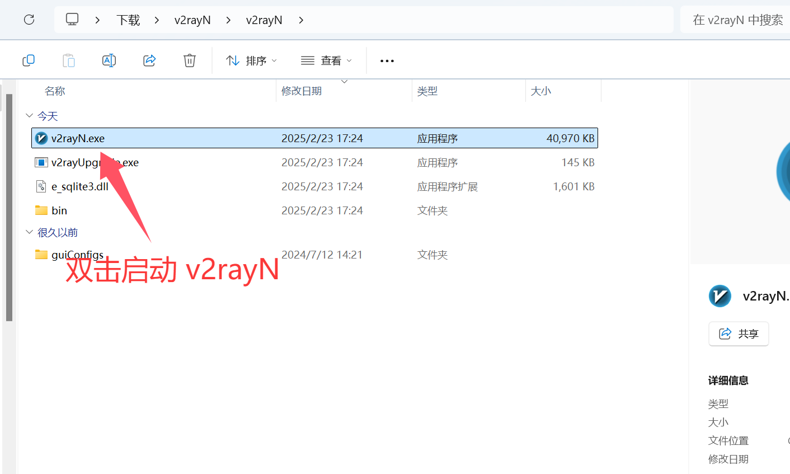
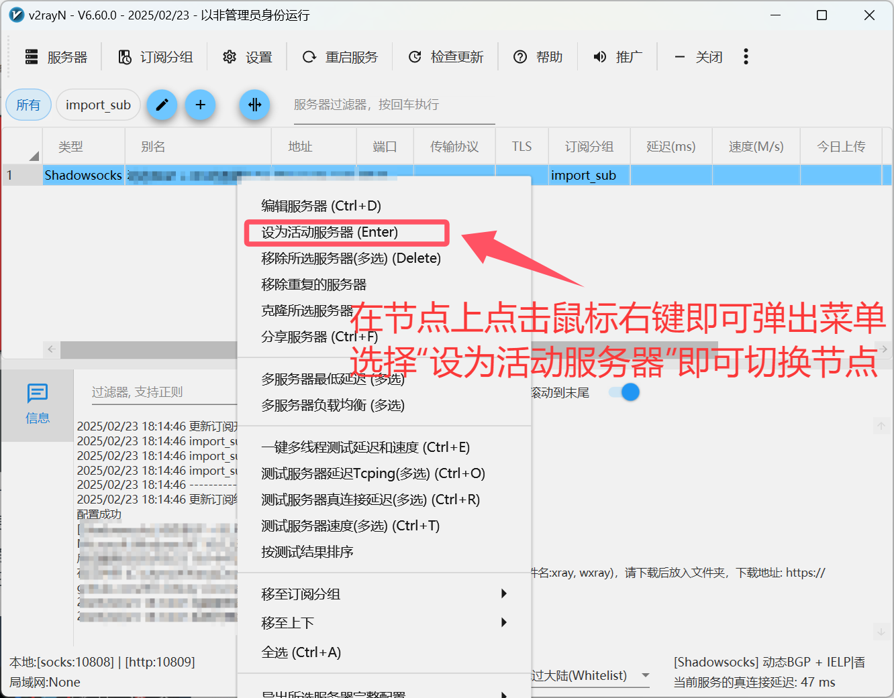

# v2rayN for Windows

[v2rayN](https://github.com/2dust/v2rayN/releases/download/6.60/v2rayN.zip) 是在 Windows 系统上的图形客户端，支持多种代理协议（SS、SSR、Socks、Snell、V2Ray、Trojan 等）。

## 系统要求

- Windows 10 及以上（64-bit）

## 使用教程

### 1. 启动 v2rayN

把下载好的 v2rayN 解压到任意目录后，双击 `v2rayN.exe` 启动。

### 2. 复制订阅链接

### 3. 导入订阅链接

### 4. 更新订阅节点

### 5. 开启代理

### 6. 切换节点

### 7. 关闭代理

## 更新记录

*最后更新: 2025年2月23日*
